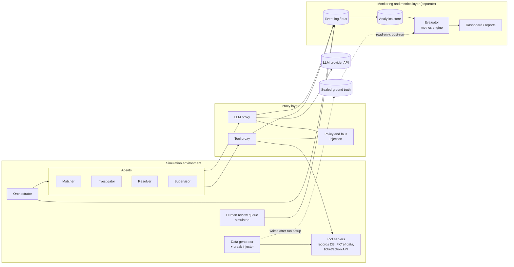
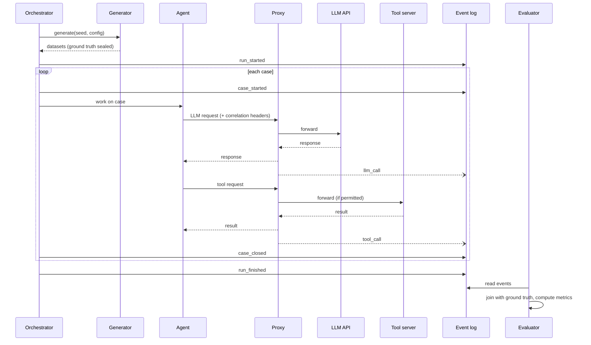

# Agentic Reconciliation Simulation: Architecture

A simulated multi-agent trade-reconciliation environment, with a **proxy layer** that intercepts all agent activity and a **separate monitoring/metrics layer** that never touches the simulation directly.

---

## 1. Design principles

1. **Agents are unaware of monitoring.** They only know a base URL (the proxy). No logging, tracing or metrics code lives inside agent code.
2. **The proxy is the single observation point.** Every LLM call and every tool call crosses it. If it didn't go through the proxy, it didn't happen.
3. **The monitoring layer is a separate deployable.** It consumes an event stream and shares no code or imports with the simulation. The only contract is the event schema (section 6).
4. **Ground truth is sealed.** The simulator knows which breaks it injected. Agents never see this. Only the evaluator in the monitoring layer can read it, after a run.
5. **Everything is replayable.** Runs are seeded, events are append-only, so any run can be re-scored with new metrics later.

---

## 2. System overview



---

## 3. Simulation environment

Runs independently of anything downstream. It could be deleted and replaced without touching monitoring.

### 3.1 Data generator and break injector

| Item | Detail |
|---|---|
| Inputs | Seed, number of trades, break rate, break-type mix |
| Outputs | Two datasets (internal books, counterparty feed), reference data (FX rates, security master) |
| Break types | Price mismatch, quantity mismatch, missing leg, duplicate, timing/settlement-date difference, wrong counterparty, FX rounding |
| Difficulty knob | Mix of obvious breaks and ambiguous ones (e.g. a price diff that is really an FX issue) |
| Ground truth | Written once to a sealed store: `{trade_id, break_type, correct_resolution, requires_human}` |

### 3.2 Agents

| Agent | Role | Tools | Authority |
|---|---|---|---|
| **Matcher** | Pair records across the two sources | `query_records` | Read-only |
| **Investigator** | Diagnose each unmatched pair or break | `query_records`, `get_fx_rate`, `get_security_ref`, `get_trade_history` | Read-only |
| **Resolver** | Propose or apply a fix | `propose_adjustment`, `apply_adjustment` | Auto-apply below a notional limit |
| **Supervisor** | Decide escalate vs. proceed | `escalate_to_human`, `approve` | Anything above limit or below confidence threshold goes to the human queue |

Agents are thin wrappers around an LLM client configured with `base_url = <proxy>`. Each request carries identifying headers (section 4.3).

### 3.3 Tool servers

Plain HTTP (or MCP) services backed by the generated data. The Resolver's `apply_adjustment` mutates simulated state, so you can later check whether the end state is correct.

### 3.4 Orchestrator

Drives the pipeline per break (`match -> investigate -> resolve -> supervise`), assigns `run_id` and `case_id`, handles retries, and emits lifecycle events (`case_started`, `case_closed`) to the event log. It is the only simulation component that writes to the bus directly, and only for lifecycle events it alone knows about.

### 3.5 Human review queue (simulated)

A stub that receives escalations and returns a decision after a configurable delay, optionally with a configurable error rate. It lets you measure escalation load and human-in-the-loop latency.

---

## 4. Proxy layer

The proxy sits between agents and everything they call. It is the only source of per-call telemetry.

### 4.1 LLM proxy

- Exposes an API-compatible endpoint (same request/response shape as the upstream provider), so agents need no code changes beyond `base_url`.
- Forwards to the real provider, streams responses back.
- Records, per call: model, prompt and completion (or hashes plus a pointer to blob storage), token counts, latency, time-to-first-token, status code, retries, stop reason, tool-use blocks.
- Computes cost from a price table (kept in the proxy config, not in agents).

### 4.2 Tool proxy

- Fronts all tool servers. Agents call tools through it.
- Records: tool name, arguments, result (or hash plus pointer), latency, success or error, bytes returned.
- Can enforce permission scopes per agent identity (e.g. Investigator may not call `apply_adjustment`). A denied call is itself an event.

### 4.3 Correlation headers

Every agent request includes:

| Header | Meaning |
|---|---|
| `X-Run-Id` | One simulation run |
| `X-Case-Id` | One break being worked |
| `X-Agent-Id` | Which agent (`matcher`, `investigator`, ...) |
| `X-Step-Id` | Monotonic step counter within the case |
| `X-Parent-Span-Id` | Links a call to the step that triggered it |

These are what let the monitoring layer rebuild a full trace without ever seeing agent internals.

### 4.4 Policy and fault injection (optional, configured per run)

| Feature | Purpose |
|---|---|
| Rate limits and token budgets per agent | Test behavior under quota pressure |
| Latency injection | Simulate a slow provider |
| Error injection (429/500 at X%) | Test agent retry logic |
| Tool failure injection | Test how agents handle a bad data source |
| Kill switch | Abort a run if cost exceeds a cap |

Injected faults are tagged in the event (`fault_injected: true`) so metrics can separate organic failures from planted ones.

### 4.5 Emission

The proxy writes events **asynchronously** to the event log so monitoring can never slow or break the agents. If the log is unavailable, the proxy buffers locally (e.g. to a JSONL file) and flushes later.

---

## 5. Monitoring and metrics layer

A separate service (own repo or package, own process). Inputs: the event log and the sealed ground truth. It never calls agents, the orchestrator, or tool servers.

### 5.1 Components

| Component | Responsibility |
|---|---|
| **Event log / bus** | Append-only record of all events. Start with JSONL files or SQLite; upgrade to Kafka/Redpanda if you want live streaming |
| **Ingestor** | Validates events against the schema, writes to the analytics store |
| **Analytics store** | DuckDB or Postgres (ClickHouse if volume grows). Tables: `llm_calls`, `tool_calls`, `lifecycle`, `faults`, `ground_truth` |
| **Trace builder** | Reconstructs per-case traces from correlation IDs |
| **Evaluator** | Joins traces to ground truth after a run and computes outcome metrics |
| **Dashboard / reports** | Streamlit, Grafana or generated HTML for run comparison |

### 5.2 Metric families

**Outcome (needs ground truth, computed post-run)**

| Metric | Definition |
|---|---|
| Break detection recall | Injected breaks the agents identified / all injected breaks |
| Break detection precision | Correct flags / all flags (false exceptions count against this) |
| Classification accuracy | Correct `break_type` / flagged breaks |
| Resolution correctness | Applied adjustments that match `correct_resolution` |
| Harmful action rate | Wrong adjustments actually applied to state |
| Escalation precision | Escalations that truly needed a human / all escalations |
| Missed escalation rate | Cases that needed a human but were auto-resolved |

**Efficiency (from proxy events, available live)**

| Metric | Definition |
|---|---|
| Cost per case / per run | Sum of LLM cost, grouped by agent |
| Tokens per case | Input and output separately |
| LLM calls per case | Proxy for reasoning depth or looping |
| Tool calls per case | And per tool, plus error rate |
| End-to-end latency | `case_started` to `case_closed`, p50/p95 |
| Time in LLM vs. tools vs. human queue | Latency breakdown |

**Reliability and behavior**

| Metric | Definition |
|---|---|
| Retry rate | Per agent, per fault type |
| Policy denial rate | Blocked tool calls by agent |
| Loop detection | Cases with repeated identical tool calls |
| Recovery rate | Fault-injected calls where the agent still reached a correct outcome |

**Comparison (across runs)**

Same seed with different models, prompts or authority limits gives directly comparable runs. The dashboard should support run-vs-run diffs on every metric above.

### 5.3 Why ground truth lives here

Keeping the answer key out of the simulation prevents accidental leakage into prompts, tool responses or logs the agents can see. The evaluator reads it only after `run_finished`.

---

## 6. Event contract

The only interface between the simulation/proxy and monitoring. Version it (`schema_version`).

```json
{
  "schema_version": "1.0",
  "event_id": "uuid",
  "ts": "2026-10-03T10:15:42.123Z",
  "type": "llm_call",
  "run_id": "run_0042",
  "case_id": "case_0317",
  "agent_id": "investigator",
  "step_id": 4,
  "parent_span_id": "span_3",
  "payload": {
    "model": "claude-sonnet-4-6",
    "input_tokens": 1820,
    "output_tokens": 410,
    "latency_ms": 2310,
    "status": 200,
    "stop_reason": "tool_use",
    "cost_usd": 0.0116,
    "request_ref": "blob://runs/run_0042/req_8f2.json",
    "response_ref": "blob://runs/run_0042/res_8f2.json",
    "fault_injected": false
  }
}
```

**Event types**

| Type | Emitted by | Key payload |
|---|---|---|
| `run_started` / `run_finished` | Orchestrator | Config, seed, agent versions, model names |
| `case_started` / `case_closed` | Orchestrator | Final status, resolution, escalated flag |
| `llm_call` | LLM proxy | As above |
| `tool_call` | Tool proxy | Tool name, args ref, result ref, latency, ok/error |
| `policy_denied` | Tool proxy | Agent, tool, rule |
| `fault_injected` | Proxy | Fault type, target |
| `human_decision` | Human queue stub | Decision, delay |

Large bodies (prompts, tool results) go to blob storage and are referenced by `*_ref`, keeping the event log small.

---

## 7. Run lifecycle



---

## 8. Suggested repository layout

```
agentic-sim/
├── sim/                      # simulation environment (no monitoring imports)
│   ├── generator/            # data + break injection, writes sealed ground truth
│   ├── agents/               # matcher, investigator, resolver, supervisor
│   ├── tools/                # tool servers
│   ├── human_queue/
│   └── orchestrator.py
├── proxy/                    # LLM + tool proxy, policy, fault injection
│   ├── llm_proxy.py
│   ├── tool_proxy.py
│   ├── policy.yaml
│   └── emitter.py            # async event writer with local buffer
├── contract/                 # event schema only; shared by proxy and monitoring
│   └── events.schema.json
├── monitoring/               # separate deployable
│   ├── ingest/
│   ├── store/                # DuckDB / Postgres schema
│   ├── evaluator/            # ground-truth join + metrics
│   ├── traces/
│   └── dashboard/
├── runs/                     # per-run config, blobs, event logs
└── docker-compose.yml        # sim, proxy, monitoring as separate services
```

`sim/` and `monitoring/` must not import each other. Only `contract/` is shared.

---

## 9. Technology suggestions

| Concern | Simple start | Scale-up option |
|---|---|---|
| Proxy | FastAPI or `mitmproxy`-style custom service | LiteLLM or Envoy-based gateway |
| Event log | JSONL files, SQLite | Kafka / Redpanda |
| Analytics store | DuckDB | ClickHouse / Postgres |
| Blob storage | Local filesystem | S3 / MinIO |
| Dashboard | Streamlit | Grafana |
| Tool servers | FastAPI, or MCP servers | Same |

---

## 10. Suggested build order

1. **Contract:** write `events.schema.json` first.
2. **Generator:** seeded data with injected breaks and sealed ground truth.
3. **Single agent through the proxy:** Matcher plus LLM proxy plus JSONL emitter. Confirm events appear.
4. **Tool proxy and remaining agents:** Investigator, Resolver, Supervisor.
5. **Monitoring ingest and store:** load JSONL into DuckDB, build per-case traces.
6. **Evaluator:** outcome metrics against ground truth.
7. **Dashboard and run comparison.**
8. **Fault injection and policy rules.**

---

## 11. Open decisions

- **Prompt storage:** log full prompts (best for debugging, large) or hashes only?
- **Live vs. batch metrics:** efficiency metrics can be live; outcome metrics are post-run. Do you want a live view at all?
- **Human queue realism:** fixed delay and perfect accuracy, or noisy reviewers?
- **Scale:** how many trades per run? This drives the store and bus choice.