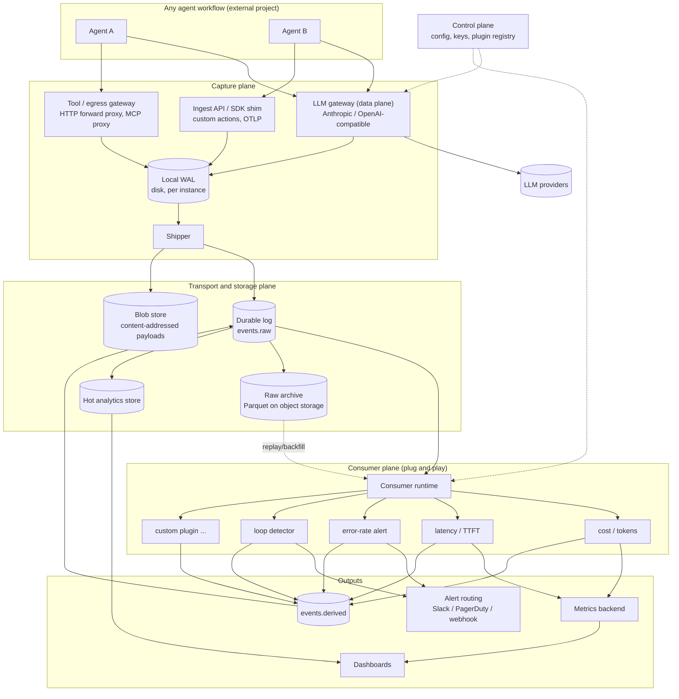
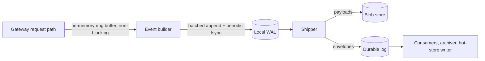

# LLM Observability Platform: Architecture

A production-grade **LLM/agent interception proxy** with durable event persistence and a **plug-and-play consumer layer** for metrics, monitoring and alerting. It is workflow-agnostic: any agent that can point at a base URL (or emit a small event) is observable. The earlier reconciliation simulation becomes a *separate test project* that exercises this platform end to end.

---

## 1. Goals and non-goals

### Goals

| # | Goal | What it means in practice |
|---|---|---|
| G1 | **Low-overhead interception** | The proxy adds minimal latency, streams pass through untouched, and observation never blocks the request path |
| G2 | **Never lose an action** | Every LLM request and observed action is persisted durably (at-least-once), even if downstream systems are down |
| G3 | **Fail open** | If logging, the broker or storage is unhealthy, agent traffic keeps flowing |
| G4 | **Plug-and-play consumers** | A new metric, alert or sink is a self-contained plugin deployed independently, with no change to the proxy |
| G5 | **Replayable** | New consumers can be run over historical events to backfill metrics |
| G6 | **Workflow-agnostic** | No assumptions about agent framework, language or orchestration |
| G7 | **Cheap to run** | Tiered storage, payload dedupe and sampling keep storage and compute proportional to value |

### Non-goals (v1)

- Not an eval or prompt-management product, though consumers can implement evals.
- Not a policy engine in the hot path. Budgets, rate limits and guardrails are an optional extension (section 12), kept out of the critical path by default.
- Not a replacement for in-process tracing of arbitrary code. See the capture-coverage limits in section 4.

---

## 2. High-level architecture

The platform has three planes with hard boundaries:

- **Capture plane:** proxies and SDK shims that observe and emit events.
- **Transport and storage plane:** durable log, archive, hot store, blob store.
- **Consumer plane:** independent plugins that read events and produce metrics, derived events and alerts.



---

## 3. LLM gateway (data plane)

### 3.1 Responsibilities

1. Accept provider-compatible requests (Anthropic `/v1/messages`, OpenAI-compatible chat/responses endpoints; add others by adapter).
2. Forward to the upstream provider with minimal modification.
3. Return the response (including SSE streams) with minimal added latency.
4. Build one event per call and hand it to the WAL, off the request path.

### 3.2 Hot-path design rules

| Rule | Rationale |
|---|---|
| **Stream passthrough, tee in memory** | Forward each SSE chunk to the client immediately; copy it to a bounded buffer for later parsing. Never wait for the full response before forwarding |
| **Parse after the response is done** | Token counts, tool-use blocks and stop reasons are extracted in a background task, not between chunks |
| **No synchronous I/O to anything but upstream** | The request path never touches the broker, blob store, database or control plane. Config and keys are cached in memory and refreshed asynchronously |
| **Bounded memory per request** | Cap the capture buffer per request (configurable). On overflow, truncate the stored payload and set `payload_truncated=true`. Never truncate what the client receives |
| **Backpressure never reaches the client** | If the WAL queue is full, drop to the configured policy (section 5.3) and count it, rather than slowing the call |
| **Client disconnects handled** | If the client aborts mid-stream, cancel upstream, record a partial event (`status=client_aborted`, tokens so far) |
| **Timeouts and retries are explicit** | The proxy does not silently retry non-idempotent calls. Retry policy is opt-in and every attempt is its own recorded span |

### 3.3 Timing captured

`t_received`, `t_upstream_sent`, `t_first_byte` (TTFT), `t_last_byte`, plus derived `proxy_overhead_ms` (time spent in the gateway excluding upstream). The overhead metric is the platform's most important self-measurement.

### 3.4 Identity and correlation

Agents add headers; the gateway also accepts the W3C `traceparent` header so it joins existing traces.

| Header | Meaning |
|---|---|
| `traceparent` | W3C trace context (preferred) |
| `X-Obs-Session-Id` | Long-lived grouping (a user task or run) |
| `X-Obs-Agent-Id` | Logical agent identity |
| `X-Obs-Tags` | Free-form `k=v` pairs (experiment, version, case id) |

If none are provided, the gateway assigns a trace ID and returns it in `X-Obs-Trace-Id` so clients can adopt it. The proxy strips `X-Obs-*` headers before forwarding upstream.

### 3.5 Credentials

Two supported modes:

- **Passthrough (default):** the client's provider key is forwarded and never stored or logged. Authorization headers are always redacted from events.
- **Virtual keys:** clients get gateway-issued keys, mapped to real provider keys held in a secret manager. This gives per-agent identity that cannot be spoofed by a header.

### 3.6 Implementation language

Recommended: **Go** (or Rust) for the gateway. It gives predictable tail latency, cheap concurrency for long-lived streams, and a small static binary. A Python (FastAPI/uvicorn) gateway is acceptable for a first iteration, but GC pauses and per-request overhead will show up in the `proxy_overhead_ms` p99 once streaming concurrency grows. Keep the event contract language-neutral so the gateway can be rewritten without touching consumers.

---

## 4. Capture coverage: what a proxy can and cannot see

Being honest about this shapes the design. A proxy sees only what crosses it.

| Agent activity | Visible how |
|---|---|
| LLM requests and responses | Directly, via the LLM gateway |
| Tool calls the model *requests* (tool-use blocks) | Directly, parsed from LLM responses. This is **intent**, not execution |
| Tool calls that run over HTTP or MCP | Via the **tool/egress gateway**, if the agent routes through it (configure `HTTP(S)_PROXY` or an MCP proxy) |
| In-process function calls, file I/O, shell commands | **Not visible** to any network proxy |
| Anything custom the agent wants to record | Via the **ingest API / SDK shim** (a thin client that posts events) |

So there are three capture modes, all producing the same event envelope:

1. **LLM gateway:** zero code change for agents.
2. **Egress/tool gateway:** zero code change if tools are network-based.
3. **Ingest API + thin SDK (and OTLP receiver):** a few lines of code for in-process actions. Accepting OTLP spans means agents already instrumented with OpenTelemetry can send directly.

The event model deliberately distinguishes `tool.call.requested` (seen in the LLM response) from `tool.call.executed` (seen at egress or reported by the SDK). Comparing the two is itself a valuable metric: tool calls requested but never executed, or executed without being requested.

---

## 5. Event model and persistence

### 5.1 Envelope

Every event, from every source, shares one versioned envelope.

```json
{
  "schema_version": "1.0",
  "event_id": "01J9ZK3Q8W2M5N7R4T6V8X0Y1A",
  "type": "llm.call.completed",
  "ts": "2026-10-03T10:15:42.123Z",
  "tenant_id": "team-a",
  "source": "llm_gateway",
  "trace_id": "4bf92f3577b34da6a3ce929d0e0e4736",
  "span_id": "00f067aa0ba902b7",
  "parent_span_id": "a1b2c3d4e5f60718",
  "session_id": "run_0042",
  "agent_id": "investigator",
  "tags": { "experiment": "baseline", "case": "0317" },
  "attributes": {
    "provider": "anthropic",
    "model": "claude-sonnet-4-6",
    "input_tokens": 1820,
    "output_tokens": 410,
    "cache_read_tokens": 1200,
    "stop_reason": "tool_use",
    "status": 200,
    "stream": true,
    "ttft_ms": 480,
    "total_ms": 2310,
    "proxy_overhead_ms": 1.4,
    "payload_truncated": false
  },
  "payload_refs": {
    "request": "blob://sha256/9f2c...",
    "response": "blob://sha256/ab41..."
  },
  "capture_mode": "redacted"
}
```

Notes:

- `event_id` is a ULID: unique, time-sortable, and the **idempotency key** for consumers.
- The shape of `attributes` follows OpenTelemetry's GenAI semantic conventions where they exist, so exports to OTel-based tooling are straightforward. Those conventions have been evolving, so check the current spec before freezing field names.
- Large bodies are never inline in the envelope. They go to the blob store and are referenced.

### 5.2 Event types (initial set)

| Type | Source | Notes |
|---|---|---|
| `llm.call.started` | LLM gateway | Optional (config flag). Enables detection of hung or in-flight calls; doubles event volume, so off by default |
| `llm.call.completed` | LLM gateway | One per call, emitted at end of response. Includes failures via `status` |
| `llm.call.failed` | LLM gateway | Upstream error, timeout, client abort |
| `tool.call.requested` | LLM gateway | Parsed from tool-use blocks |
| `tool.call.executed` | Egress gateway / SDK | Actual execution with result status and latency |
| `action.custom` | Ingest API | Free-form, namespaced (`app.reconcile.adjustment_applied`) |
| `proxy.internal` | Any gateway | Self-telemetry: drops, WAL lag, config reloads |
| `derived.*` | Consumers | Metrics, alerts, trace summaries produced by plugins |

### 5.3 Durability pipeline



- **Local WAL** on each gateway instance (append-only segment files). This decouples the request path from the network and guarantees events survive a broker outage or a gateway crash (within the fsync interval).
- **Shipper** (a goroutine or separate sidecar process) reads the WAL, uploads payloads to the blob store first, then publishes the envelope. Publishing after payload upload means a published envelope never has a dangling reference.
- **Delivery is at-least-once.** Duplicates are possible; consumers dedupe on `event_id`.
- **Ordering:** the log topic is keyed by `trace_id`, so all events of a trace land in one partition, in order.
- **Backpressure policy** (configurable): when the in-memory buffer or WAL is full, either `drop_payloads_keep_metadata` (default), `drop_newest`, or `block` (opt-in; breaks fail-open and is not recommended). Every drop increments a counter and emits a `proxy.internal` event once the system recovers.

### 5.4 Storage tiers

| Tier | Contents | Technology (suggested) | Retention |
|---|---|---|---|
| **Durable log** | Envelopes in flight | Redpanda/Kafka (or NATS JetStream for smaller footprint) | Days: enough to replay and absorb consumer outages |
| **Raw archive** | All envelopes, immutable | Parquet on S3/MinIO, partitioned by `tenant/date/hour` | Long: the source of truth for replay and backfill |
| **Hot store** | Recent envelopes, queryable | ClickHouse (DuckDB or Postgres at small scale) | Weeks to months |
| **Blob store** | Request/response bodies | S3/MinIO, content-addressed by SHA-256 | Per policy, usually shorter than the archive |

### 5.5 Cost controls for payloads

Agent loops resend an ever-growing conversation on every call, so naive full-request logging grows quadratically. Controls:

- **Message-level content addressing:** hash each message and store each unique message once. A request payload becomes a list of message hashes plus the new messages. Repeated history costs almost nothing.
- **Capture modes** per tenant, agent or tag: `full`, `redacted`, `metadata_only`.
- **Sampling** of payloads (not metadata): e.g. 100% of errors and slow calls, N% of successes. Metadata is always kept so metrics stay exact.
- **Compression** (zstd) for blobs and Parquet.
- **Lifecycle rules:** payloads expire earlier than envelopes.

### 5.6 Redaction and privacy

- Redaction runs **in the gateway before anything is written to the WAL**, so unredacted data never reaches durable storage unless `capture_mode=full` is explicitly enabled for that scope.
- Always strip auth headers and API keys. Configurable regex and detector rules for emails, card numbers, national IDs and secrets, with hash-replacement so values can still be correlated.
- Encrypt at rest and in transit. Tenant ID is part of every storage key and enforced in queries.
- Retention and deletion by tenant, session or trace to support data-subject deletion requests (e.g. GDPR). Content addressing complicates deletion of shared blobs: use reference counting or per-tenant blob namespaces.

---

## 6. Consumer plane (plug and play)

### 6.1 Model

Each consumer is an **independent deployable** that:

- subscribes to a set of event types (via manifest),
- has its **own consumer group and offsets** (so a slow or broken plugin never affects others),
- may keep local state (windows, per-trace buffers),
- emits outputs through a fixed set of channels: **metrics**, **derived events**, **alerts**, **logs**.

Adding a metric means shipping a new plugin container or package. Nothing else changes.

### 6.2 Consumer manifest

```yaml
# plugins/loop-detector/plugin.yaml
name: loop-detector
version: 1.2.0
runtime: python            # python | go | wasm (future)
subscribes:
  - llm.call.completed
  - tool.call.requested
  - tool.call.executed
group_by: trace_id          # state partitioning key
state:
  backend: local             # local | redis
  ttl: 30m
config:
  max_identical_tool_calls: 4
outputs:
  metrics:
    - name: agent_loop_detected_total
      type: counter
      labels: [agent_id, tool]
  alerts:
    - name: AgentLoopSuspected
      severity: warning
      dedupe_key: [trace_id]
  derived_events:
    - derived.loop.detected
replay:
  supported: true            # safe to run over history
```

### 6.3 Plugin interface

```python
class Processor(Protocol):
    def setup(self, ctx: Context) -> None: ...
    def on_event(self, event: Event, ctx: Context) -> None: ...
    def on_timer(self, now: datetime, ctx: Context) -> None: ...   # windows, trace-close timeouts
    def teardown(self, ctx: Context) -> None: ...

# ctx provides: state store, emit_metric(), emit_alert(), emit_event(),
#               log(), clock (event-time aware), config, blob.get(ref)
```

Runtime guarantees to plugin authors:

- Events arrive **at least once** and **ordered per `trace_id`**; the runtime dedupes on `event_id` before calling the plugin.
- A clock abstraction supplies **event time**, not wall time, so the same plugin gives the same result live and during replay.
- Exceptions are isolated: a poison event goes to a per-plugin **dead-letter queue** after N attempts; the plugin keeps running.
- `blob.get(ref)` lets plugins fetch payloads lazily (most metrics need only the envelope).

### 6.4 Reference plugins (shipped with the platform)

| Plugin | Type | Output |
|---|---|---|
| `cost-and-tokens` | Stateless | Cost per call/agent/session from a versioned price table; token counters |
| `latency` | Stateless | Latency, TTFT and proxy-overhead histograms per model |
| `error-rate` | Windowed | Rolling error/429/timeout rates; alert on threshold breach |
| `trace-summarizer` | Per-trace state | On trace close, emits `derived.trace.summary` (calls, tokens, cost, tools, duration, outcome) |
| `loop-detector` | Per-trace state | Repeated identical tool calls or near-identical prompts |
| `tool-gap` | Cross-event | Tools requested but never executed, or executed without a request |
| `budget-guard` | Windowed | Spend per agent/tenant vs budget; alert at 80%/100% |
| `pii-scan` | Stateless | Post-hoc detection of sensitive data in payloads |
| `log-sink` | Sink | Structured logs to a stdout/Loki/ELK pipeline |

Workflow-specific scoring (such as the reconciliation precision/recall from the earlier design) is simply **another plugin**, living in the test project and joining events to its own ground truth. This is the proof that the plug-and-play model works.

### 6.5 Chaining

Plugins can consume `derived.*` events from other plugins (for example an alerting plugin that reads `derived.trace.summary`). Keep the graph acyclic; the runtime validates subscriptions at registration time and rejects cycles.

### 6.6 Replay and backfill

- **Live:** the consumer group tails the durable log.
- **Backfill:** register a plugin with `--from=<timestamp>`; the runtime reads the **raw archive** (and the log for the recent tail), feeding events through the same code path in event-time order.
- **Idempotent outputs:** metrics and derived events carry deterministic IDs (hash of plugin, version, input event IDs), so re-running does not double count. Alerts are suppressed during backfill unless explicitly enabled.
- Bumping a plugin version can trigger a re-run to produce corrected history.

### 6.7 Plugin deployment

| Option | Notes |
|---|---|
| Container per plugin (default) | Strong isolation, independent scaling, any language |
| In-process runtime hosting multiple Python plugins | Simpler for small setups; shares a failure domain |
| WASM plugins (future) | Sandboxed, language-neutral, cheap to host many |

A **plugin registry** in the control plane records name, version, manifest, owner, and health. Rolling upgrades and canary versions run as separate consumer groups on the same topic.

---

## 7. Metrics, monitoring and alerting

### 7.1 Metrics path

Plugins emit metrics through the runtime, which exposes a Prometheus scrape endpoint (or writes OTLP). Label cardinality is controlled by the runtime: plugins declare allowed labels in the manifest and the runtime rejects unknown or high-cardinality ones (trace_id, raw prompts). High-cardinality investigation goes to the hot store, not the metrics backend.

### 7.2 Two kinds of alerts

| Kind | Evaluated by | Examples |
|---|---|---|
| **Metric alerts** | Metrics backend (Prometheus rules / Alertmanager) | Error rate > 5% for 5m, p99 latency, spend rate |
| **Event alerts** | Consumer plugins | Loop suspected on a trace, tool executed that was never requested, PII detected, call to unexpected host |

Event alerts are emitted as `derived.alert.*` events, then routed by an **alert router** consumer: dedupe and grouping by key, severity mapping, silences, and fan-out to Slack, PagerDuty or webhooks. Routing rules live in config, not plugin code.

### 7.3 Dashboards

- Operational (metrics backend): throughput, error rates, latency, cost per agent/model, and **platform health** (section 8).
- Investigative (hot store): drill from an alert to the trace, to the individual calls, to payloads. Link every alert to a trace view.

---

## 8. Self-observability and SLOs

The platform monitors itself with the same machinery.

| Signal | Why |
|---|---|
| `proxy_overhead_ms` histogram | Core promise (G1); alert if p99 regresses |
| WAL depth and age of oldest unshipped event | Detects shipper or broker trouble before data is at risk |
| Events dropped (by reason) | Should be zero; any drop is an incident |
| Shipper publish latency and error rate | Broker health |
| Consumer lag per plugin | Slow or stuck plugins |
| DLQ size per plugin | Poison events and bugs |
| Archive write lag | Replay completeness |
| End-to-end freshness: request time to queryable in hot store | User-facing data latency |

**Design targets** (to be validated by load tests, not assumed):

- Added latency p99 under a few milliseconds for non-streaming calls and under about a millisecond added to time-to-first-token.
- Zero request failures attributable to observability components during broker or storage outage.
- Event loss near zero while within WAL capacity (size the WAL for several hours of peak traffic).
- Data queryable in the hot store within seconds under normal operation.

---

## 9. Deployment topology

| Topology | Pros | Cons |
|---|---|---|
| **Central gateway cluster** (stateless replicas behind a load balancer) | One place to operate; simple client config | Extra network hop; shared blast radius |
| **Sidecar per agent/service** | No extra hop to a remote gateway, strong isolation | More processes; config distribution |
| **Hybrid** | Sidecar for latency-critical, central for the rest | More to operate |

Start with a central cluster. Gateway replicas are stateless apart from their local WAL, so scale horizontally and give each instance durable local disk (or a persistent volume) for the WAL. On graceful shutdown, drain in-flight streams and flush the WAL. On crash, the shipper resumes from the last acknowledged WAL offset on restart.

Everything else (broker, consumers, stores) is deployed as ordinary services. Kubernetes is the natural target; the same design works with Docker Compose for local development.

---

## 10. Control plane

Small and **off the hot path**:

- Tenant and agent registry, virtual keys, capture-mode and redaction config.
- Plugin registry and rollout state.
- Price tables and model metadata (versioned, so cost metrics are reproducible).
- Alert routing rules.

Gateways and the consumer runtime pull config on an interval and cache it. If the control plane is down, they keep running on the last known config.

---

## 11. Security

- TLS everywhere; mTLS between gateway, shipper, broker and consumers.
- Gateway never logs credentials; secrets in a secret manager.
- Per-tenant isolation in storage keys, topics (or topic ACLs) and query layer.
- Role-based access to payload viewing, separate from metric viewing. Most users see metadata only.
- The proxy itself is a high-value target: it handles provider keys and prompts. Minimize its dependencies, run it with least privilege, keep the image small, and scan and pin dependencies.
- Prompt and response bodies can contain adversarial content. Treat all payloads as untrusted data in consumers and dashboards (escape on render; never execute or interpret as instructions).

---

## 12. Optional extension: policy in the proxy

Because the gateway sees every call, it can also enforce budgets, rate limits, model allowlists or guardrails. To keep G1 and G3 intact:

- Evaluate only **local, in-memory** rules on the hot path (token buckets, allowlists). No network calls.
- Distribute decisions computed by consumers (for example, `budget-guard` marking an agent as over budget) to gateways via the control plane as cached state, with a short propagation delay.
- Define a **fail-open or fail-closed** setting per rule, defaulting to open, and make every enforcement action an event.

---

## 13. Testing strategy

| Layer | Approach |
|---|---|
| **Contract** | JSON Schema for the envelope and each event type; CI fails on breaking changes; consumers tested against fixture events from every schema version |
| **Gateway correctness** | Golden tests with recorded provider responses (including streaming, tool use, errors, truncated streams, client aborts); assert client-visible bytes are identical to upstream |
| **Deterministic upstream** | A **mock LLM provider** with configurable latency, token counts, errors, and slow-streaming behavior, so tests need no real API and cost nothing |
| **Performance** | Load tests measuring `proxy_overhead_ms`, TTFT delta vs direct-to-upstream, memory per concurrent stream, throughput at N concurrent streams |
| **Chaos** | Kill the broker, fill the disk, kill the shipper, restart the gateway mid-stream; assert agent traffic is unaffected and no events are lost within WAL limits |
| **Consumer** | Plugin unit tests with the runtime's test harness; replay tests asserting live and backfill outputs are identical |
| **End to end** | The **separate example workflow project** (the reconciliation simulation) runs against the platform with known ground truth. Its scoring plugin verifies that the platform captured everything: every injected scenario appears in the events with correct token counts and trace linkage |

---

## 14. Repository layout

```
llm-observability/
├── contract/                    # source of truth for events
│   ├── envelope.schema.json
│   ├── events/                  # one schema per event type
│   └── fixtures/                # sample events per version
├── gateway/                     # LLM gateway + egress proxy (Go)
│   ├── providers/               # anthropic, openai-compatible adapters
│   ├── capture/                 # tee, event builder, redaction
│   ├── wal/
│   ├── shipper/
│   └── cmd/
├── ingest/                      # ingest API + OTLP receiver
├── sdk/                         # thin client shims (python, ts)
├── runtime/                     # consumer runtime
│   ├── dispatcher/              # subscriptions, dedupe, ordering, DLQ
│   ├── state/                   # local/redis backends
│   ├── outputs/                 # metrics, alerts, derived events
│   └── replay/                  # archive reader, event-time clock
├── plugins/                     # reference plugins, each self-contained
│   ├── cost-and-tokens/
│   ├── latency/
│   ├── error-rate/
│   ├── trace-summarizer/
│   ├── loop-detector/
│   ├── tool-gap/
│   ├── budget-guard/
│   └── log-sink/
├── alerting/                    # router: dedupe, silences, channels
├── storage/                     # archiver, hot-store writer, schemas, lifecycle
├── control-plane/               # config API, registry
├── testing/
│   ├── mock-provider/
│   ├── load/
│   └── chaos/
├── deploy/                      # helm charts, compose
└── docs/

# Separate repository
reconciliation-workflow-sim/     # the example agent workflow + its scoring plugin
```

---

## 15. Technology summary

| Concern | Recommended | Lighter alternative |
|---|---|---|
| Gateway | Go (or Rust) | Python FastAPI for v1 |
| Durable log | Redpanda / Kafka | NATS JetStream, or Postgres outbox at very small scale |
| Raw archive | Parquet on S3/MinIO | Local Parquet files |
| Hot store | ClickHouse | DuckDB / Postgres |
| Blob store | S3/MinIO | Local filesystem |
| Metrics | Prometheus (+ Alertmanager) | OTLP to any backend |
| Consumer plugins | Python (SDK), containerized | In-process Python |
| Config/registry | Postgres | SQLite |
| Tracing interop | W3C traceparent, OTLP in/out | |

---

## 16. Build vs. buy

Open-source and commercial LLM gateways and observability tools already exist (LiteLLM, Helicone, Langfuse and Portkey are examples). I haven't re-verified their current feature sets, so check them before committing. Building this is justified if you specifically want: the WAL-based fail-open durability guarantees, the replayable plug-in consumer model with event-time semantics, tool-execution capture alongside LLM calls, and full control over the data path. A reasonable hybrid is to adopt the OTel GenAI conventions and OTLP so your data stays portable and you can plug into existing tools at any point.

---

## 17. Phased roadmap

| Phase | Deliverable | Exit criterion |
|---|---|---|
| **0. Contract** | Envelope and event schemas, fixtures, mock provider | Schemas reviewed; mock provider streams correctly |
| **1. Minimal gateway** | Anthropic + OpenAI-compatible passthrough, streaming tee, WAL to local files | Byte-identical responses vs. direct; overhead measured |
| **2. Transport and storage** | Shipper, broker, blob store, archiver, hot-store writer | Events queryable end to end; broker-outage test passes |
| **3. Consumer runtime** | Dispatcher, dedupe, state, DLQ, metrics output, 3 reference plugins | A new plugin deploys without touching other components |
| **4. Alerting and replay** | Alert router, event-time clock, archive backfill | Backfill output equals live output |
| **5. Wider capture** | Egress proxy, ingest API/OTLP, SDK, `tool-gap` plugin | Requested vs. executed tool calls reconciled |
| **6. Hardening** | Redaction, virtual keys, RBAC, chaos and load suites, SLO dashboards | SLO targets validated under load |
| **7. Integration test** | Example workflow project wired in, with its scoring plugin | Platform captures 100% of scenario events |

---

## 18. Open decisions

1. **Scale:** expected calls per second and concurrent streams? This decides broker, hot store and gateway topology.
2. **Providers:** only Anthropic and OpenAI-compatible, or others (Bedrock, Vertex, local models)?
3. **Payload policy:** full capture by default, or metadata-only with sampled payloads?
4. **Tenancy:** single team, or multi-tenant with strict isolation from day one?
5. **Fail-open vs. fail-closed:** is silently losing observability ever unacceptable (e.g. audit requirements)? If so, a `block` backpressure mode for specific tenants may be needed.
6. **Plugin languages:** Python-only, or polyglot from the start?
7. **Gateway language:** accept Go/Rust, or start in Python for speed of iteration?