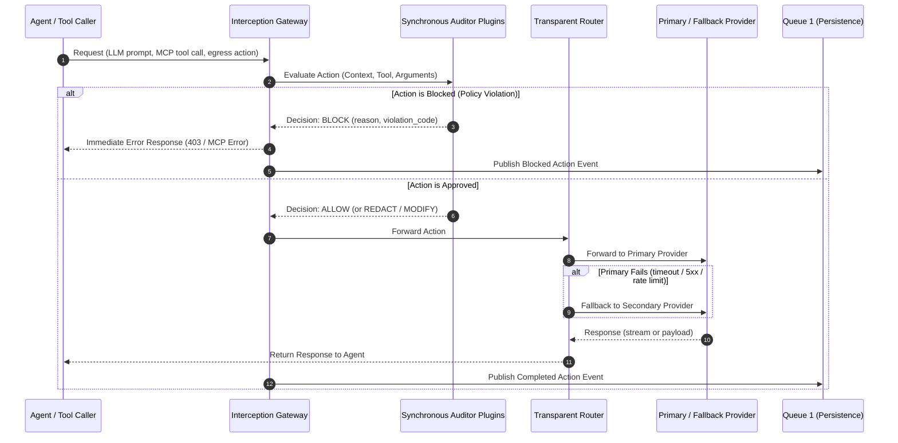
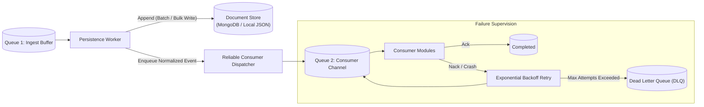
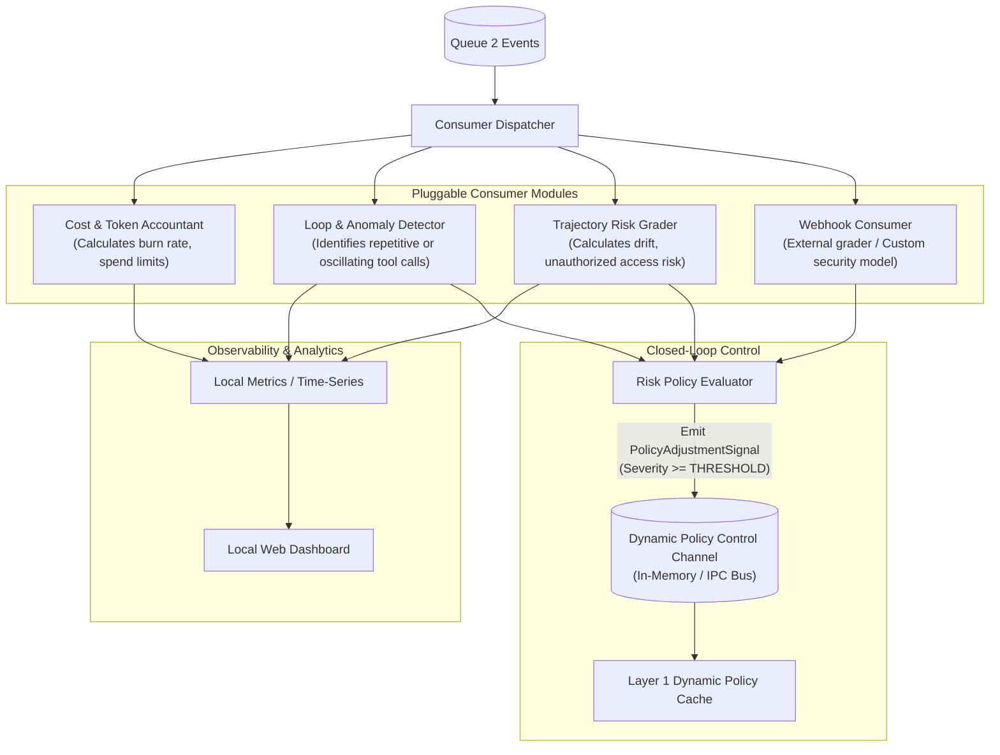

# Local Agent Gateway & Control Plane: Architecture

A lightweight, locally runnable **interception, persistence, and consumer gateway** designed to run on the same system (or sidecar) as the agentic loop. 

Unlike heavy distributed enterprise platforms, this architecture provides a **clean, modular, and maintainable local control layer** that unifies:
1. **Synchronous Action Interception & Auditing** (inspect, evaluate, block, or transparently route LLM and MCP/tool actions).
2. **Decoupled Document Persistence** (buffered, non-blocking append to a JSON/MongoDB document store with reliable consumer queueing and retry management).
3. **Asynchronous Consumer & Risk Intelligence** (pluggable metric calculation, agent trajectory risk grading, and a **dynamic feedback loop** that tightens interception rules in real-time).

---

## 1. Core Architectural Overview

The system operates across three tightly scoped layers connected by asynchronous queues and a dynamic policy feedback channel:

```mermaid
flowchart TB
    subgraph LOCAL_HOST["Local Host / Agent Environment"]
        subgraph AGENT_ENV["Agent Execution Plane"]
            AGENT["Agentic Loop / Runtime"]
        end

        subgraph LAYER1["Layer 1: Interception Layer (Gateway & Policy Guard)"]
            direction TB
            ENTRY["Gateway Listener<br/>(LLM HTTP / MCP JSON-RPC / Tool Proxy)"]
            AUDIT_PIPE["Synchronous Policy Pipeline<br/>(In-Process Callbacks & Webhook Auditors)"]
            ROUTER["Transparent Router & Fallback<br/>(Primary Provider -> Fallback Provider)"]
            UPSTREAM[("Configured Upstream<br/>LLM Providers / MCP Servers")]
            PACKER["Event Normalizer & Packager"]
            Q1[("Queue 1: Ingestion Buffer<br/>(In-Memory / Local Queue)")]

            ENTRY --> AUDIT_PIPE
            AUDIT_PIPE -- "BLOCK / REJECT" --> ENTRY
            AUDIT_PIPE -- "ALLOW" --> ROUTER
            ROUTER <--> UPSTREAM
            ROUTER --> PACKER
            PACKER --> Q1
        end

        subgraph LAYER2["Layer 2: Persistence Layer (Document Store & Reliable Dispatcher)"]
            direction TB
            PERSIST_WORKER["Persistence Worker"]
            DOC_STORE[("Document Store<br/>(MongoDB / JSON Append Store)")]
            Q2_DISPATCHER["Consumer Dispatcher & Retry Supervisor"]
            Q2[("Queue 2: Consumer Queue<br/>(With Exponential Retries & DLQ)")]

            Q1 --> PERSIST_WORKER
            PERSIST_WORKER --> DOC_STORE
            PERSIST_WORKER --> Q2_DISPATCHER
            Q2_DISPATCHER --> Q2
        end

        subgraph LAYER3["Layer 3: Consumer Layer (Risk Intelligence & Observability)"]
            direction TB
            CONSUMER_RUNTIME["Consumer Manager"]
            subgraph PLUGINS["Pluggable Consumer Modules"]
                P_METRICS["Metrics & Cost Observer"]
                P_LOOP["Loop & Anomaly Detector"]
                P_RISK["Trajectory Risk Grader"]
                P_CUSTOM["Custom Webhook / Callback"]
            end
            SINKS["Observability Sinks<br/>(Dashboard / Logs / Exports)"]
            FEEDBACK_GEN["Policy Feedback Controller"]

            Q2 --> CONSUMER_RUNTIME
            CONSUMER_RUNTIME --> PLUGINS
            PLUGINS --> SINKS
            P_RISK & P_LOOP --> FEEDBACK_GEN
        end

        FEEDBACK_GEN -. "Dynamic Policy Update<br/>(Escalate Rules / Strict Mode / Block)" .-> AUDIT_PIPE
    end

    AGENT <--> ENTRY
```



### Architectural Highlights

- **Local-First & Resource-Lean:** Runs as an embedded process or lightweight local daemon on the agent's host. No heavy distributed message brokers (Kafka/Zookeeper) or multi-tier object storage clusters required.
- **Fail-Safe & Low Latency:** The hot interception path performs fast deterministic evaluations and transparent routing without waiting for database operations or complex analytics.
- **Bi-Directional Risk Supervision:** Consumers don't just passively log metrics—they calculate compound risk and actively feed updated policies back into the interception layer to constrain rogue agents dynamically.

---

## 2. Layer 1: Interception Layer (Gateway & Policy Enforcement)

The Interception Layer sits directly in the path between the agent and external resources (LLMs, MCP servers, tools). It is responsible for intercepting requests, evaluating actions against synchronous audit rules, handling transparent upstream routing with fallback, and pushing normalized action records to the persistence layer.



### 2.1 Interception Scope

The gateway intercepts agent actions at three natural boundary interfaces:
1. **LLM API Proxy:** Exposes standard OpenAI (`/v1/chat/completions`) and Anthropic (`/v1/messages`) compatible endpoints. Supports both buffered requests and streaming Server-Sent Events (SSE).
2. **MCP (Model Context Protocol) Proxy:** Intercepts JSON-RPC tool invocations (`tools/call`, `resources/read`, `prompts/get`) between agents and MCP servers.
3. **HTTP Egress / In-App Tool Callbacks:** Acts as an egress proxy for REST tools, or provides a lightweight programmatic SDK wrapper for in-process function execution.

### 2.2 Synchronous Action Auditing & Pluggable Policies

Before any action is sent to an external provider or executed on a tool, it passes through an extensible **Action Auditor Pipeline**.

#### The Decision Contract
Each auditor plugin evaluates the proposed action and returns a deterministic evaluation:
- `ALLOW`: The action complies with policies; forward immediately.
- `BLOCK`: The action violates policy; reject immediately and return a structured error to the agent.
- `REDACT`: Sanitize sensitive fields (e.g., tokens, PII) in arguments before forwarding.
- `REQUIRE_APPROVAL`: Pause execution until an external local confirmation is provided.
- `ALERT`: Allow the action to proceed, but emit a high-priority warning event to the dashboard and increase session risk score.

#### Dual Plugin Delivery Mechanisms
To make the system easily extendable and polyglot-friendly, two plugin integration modes are supported:
1. **In-Application Callbacks (In-Process):** Fast, zero-overhead Python/Go functions implementing a standard `ActionAuditor` interface. Ideal for fast local regex, allowlists, argument bounds checking, and token budgets.
2. **Webhook Callbacks (HTTP/gRPC):** Configured HTTP endpoints that receive the action payload and return a decision JSON. Ideal for running isolated policy checkers, local LLM-based guard models, or existing external policy daemons.

#### Example Auditor Configuration (`gateway_config.yaml`)
```yaml
interception:
  port: 8080
  strict_mode: false # Can be dynamically toggled by Layer 3 feedback
  
  auditors:
    # 1. In-process deterministic validator (ordered chain)
    - name: "tool-allowlist"
      type: "in_process"
      handler: "core.auditors.allowlist:ToolAllowlistAuditor"
      config:
        allowed_tools: ["search_docs", "calculate_margin", "query_portfolio"]
        block_action: "reject"

    # 2. Secret & PII scanner
    - name: "credential-shield"
      type: "in_process"
      handler: "core.auditors.security:CredentialShieldAuditor"
      config:
        patterns: ["aws_secret", "private_key", "password"]

    # 3. External Webhook for complex or polyglot rule checks
    - name: "compliance-evaluator"
      type: "webhook"
      endpoint: "http://127.0.0.1:9090/audit/action"
      timeout_ms: 150
```

#### Dynamic Configuration Hot-Reloading
The policy engine continuously monitors `gateway_config.yaml` / `policy.yaml` for file modification events (via inotify / file watcher). When configuration files are modified (e.g. judges adjusting thresholds, toggling allowlists, or updating token budgets during evaluation):
- Updated policies are immediately validated and swapped in-memory.
- In-flight and new requests immediately bind to the new policy without restarting the agentic loop.
- A `policy_reloaded` event is emitted to the persistence layer with the new policy version hash.

### 2.3 Transparent Backend Routing & Fallback

The interception layer decouples the agent from specific hardcoded LLM endpoints or MCP servers, enabling resilient transparent fallback:

- **Provider Routing:** Maps abstract model names requested by the agent (e.g., `primary-reasoning-model`) to specific backends (e.g., local Ollama, vLLM, Anthropic, OpenAI).
- **Automated Fallback:** If the primary backend returns a `429 (Rate Limit)`, `5xx (Server Error)`, or times out, the router automatically fails over to the configured secondary backend without breaking the agentic loop.
- **MCP Backend Gateway:** Maps tool calls to either local stdio MCP processes, local HTTP/SSE servers, or fallback endpoints.

```yaml
routing:
  llm:
    providers:
      anthropic_primary:
        type: "anthropic"
        base_url: "https://api.anthropic.com"
        api_key_env: "ANTHROPIC_API_KEY"
      ollama_local_fallback:
        type: "openai_compatible"
        base_url: "http://127.0.0.1:11434/v1"
        api_key_env: "EMPTY"

    routes:
      "claude-3-5-sonnet":
        primary: "anthropic_primary"
        fallback: "ollama_local_fallback"
        timeout_seconds: 30
        retry_on_status: [429, 500, 502, 503, 504]
```

### 2.4 Event Packaging & Queue Handoff

Once an action completes (or is blocked), the gateway packages the complete interaction into an **Application-Level Action Event** and asynchronously enqueues it into `Queue 1`. 

**Critical Invariant:** Enqueuing to `Queue 1` is completely non-blocking (in-memory ring buffer or fast local queue). The agent request path **never** waits for database disk writes.

---

## 3. Layer 2: Persistence Layer (Document Store & Queueing Pipeline)

The Persistence Layer ensures that every action is reliably preserved for local querying and auditing, while safely decoupling storage workloads from asynchronous consumer processing.



### 3.1 Document Store (MongoDB / Append-Optimized Store)

Agent actions represent rich, dynamic, nested documents (prompts, tool parameters, structured responses, JSON-RPC payloads). **MongoDB (or a local document store)** is the ideal persistence target because:
1. **Schema Agnostic & Natural JSON:** Arbitrary tool arguments and provider-specific attributes map 1:1 without relational schema migrations.
2. **High-Throughput Append Workloads:** MongoDB handles rapid append-only writes via time-bucketed collections or capped collections with minimal write latency.
3. **Rich Local Querying:** Easily query action histories by session, trace, tool name, or risk attributes for local debugging and dashboard exploration.

#### Indexing Strategy
```javascript
// Primary query patterns for local observability
db.agent_actions.createIndex({ "trace_id": 1, "ts": 1 });
db.agent_actions.createIndex({ "session_id": 1, "ts": 1 });
db.agent_actions.createIndex({ "action_type": 1, "status": 1 });
db.agent_actions.createIndex({ "risk_metadata.risk_level": 1 });
```

### 3.2 Reliable Queue 2 & Consumer Supervision

After the persistence worker commits an event to the document store, it pushes the event to **Queue 2** for downstream evaluation:
- **Decoupled Failure Domains:** A failure, bug, or slow execution in a consumer module never impacts the persistence layer or the interception gateway.
- **At-Least-Once Delivery:** Events in Queue 2 require explicit consumer acknowledgment (`ACK`).
- **Retry Mechanism with Exponential Backoff:** If a consumer fails or times out (e.g., an external webhook consumer is temporarily unreachable), the dispatcher retries delivery with jittered exponential backoff.
- **Dead Letter Queue (DLQ):** Messages exceeding `max_retries` are moved to a local dead-letter store for offline inspection without stalling the consumer pipeline.

---

## 4. Layer 3: Consumer Layer (Risk Intelligence & Feedback Control)

The Consumer Layer executes in the background. It consumes persisted events from Queue 2, calculates rolling metrics, evaluates agent behavior across multiple steps, and—critically—**exerts dynamic feedback control back onto Layer 1**.



### 4.1 Pluggable Consumer Modules

Consumers are designed as isolated, plug-and-play plugins implementing an asynchronous processor interface:
- **In-Process Modules:** Python/Go worker coroutines that run in the background consumer process.
- **Webhook Consumers:** HTTP endpoints that receive streaming batches of events, allowing external tools, evaluation frameworks, or specialized microservices to analyze traces.

#### Reference Consumer Implementations
1. **Loop & Oscillation Detector:** Tracks tool invocations within a rolling window (`trace_id`). If an agent calls the same tool with identical or alternating parameters more than $N$ times, flags an infinite loop risk.
2. **Trajectory & Drift Grader:** Analyzes the sequence of actions against the expected workflow or contract. Detects deviations (e.g., agent was tasked with data retrieval but suddenly attempts file deletion or network discovery).
3. **Spend & Velocity Accountant:** Aggregates token consumption and cost per session. Tracks rate-of-burn to catch runaway recursive agent loops before resource exhaustion.

### 4.2 Dynamic Feedback Loop: Influencing the Interception Layer

Traditional observability is purely passive; by the time a human reads a dashboard, the agent has already executed unwanted actions. 

This architecture introduces a **closed-loop feedback mechanism**:
1. When a consumer (e.g., `Trajectory Risk Grader` or `Loop Detector`) identifies suspicious, risky, or anomalous behavior, it synthesizes a **`PolicyAdjustmentSignal`**.
2. The signal is dispatched over a local fast IPC channel (in-memory state, local event bus, or unix domain socket) to the Interception Layer's **Dynamic Policy Cache**.
3. Layer 1 immediately updates its runtime policy for the affected `session_id` or `agent_id`:
   - **Enforce Strict Allowlist:** Disable optional or potentially dangerous tools.
   - **Enforce Human Approval:** Convert automatic tool execution into `REQUIRE_APPROVAL` mode.
   - **Throttle / Rate-Limit:** Add synthetic delay or limit token budget for the session.
   - **Hard Halt:** Issue a session-wide `BLOCK` for all subsequent LLM or tool requests.

```json
// Example: PolicyAdjustmentSignal emitted by Trajectory Risk Grader
{
  "signal_id": "sig_01J9ZK49B...",
  "ts": "2026-10-03T15:45:00.120Z",
  "target_scope": {
    "session_id": "session_trade_execution_981",
    "agent_id": "execution_agent_v2"
  },
  "action": "ESCALATE_POLICY",
  "policy_modifications": {
    "strict_mode": true,
    "require_approval_for": ["execute_trade", "transfer_funds"],
    "blocked_tools": ["shell_exec", "eval_code"]
  },
  "reason": "Anomalous tool call velocity detected (5 attempts in 2 seconds) with parameter drift.",
  "ttl_seconds": 600
}
```

---

## 5. Unified Data Contracts & Interfaces

To maintain clean separation and make the system truly extendable, all components communicate via standardized schemas and programming interfaces.

### 5.1 Application Action Event Envelope (Stored in DB & Queues)

```json
{
  "schema_version": "2.0",
  "event_id": "evt_01J9ZK3Q8W2M5N7R4T6V8X0Y1A",
  "trace_id": "tr_4bf92f3577b34da6a3ce929d0e0e4736",
  "session_id": "sess_reconcile_0042",
  "agent_id": "financial_reconciler",
  "ts": "2026-10-03T15:42:10.500Z",
  "action_type": "tool_call", 
  "source": "mcp_proxy",
  "status": "completed", 
  
  "action_details": {
    "name": "adjust_ledger_balance",
    "parameters": {
      "account_id": "ACC-9921",
      "adjustment_cents": 125000,
      "reason": "Variance reconciliation"
    },
    "result": {
      "success": true,
      "ledger_entry_id": "LED-55102"
    }
  },

  "interception_metadata": {
    "auditor_decisions": [
      {
        "auditor": "credential-shield",
        "decision": "ALLOW",
        "latency_ms": 0.8
      }
    ],
    "routed_upstream": "mcp-accounting-service",
    "fallback_triggered": false,
    "interception_overhead_ms": 1.2
  },

  "metrics": {
    "input_tokens": 450,
    "output_tokens": 85,
    "latency_ms": 142.5
  },

  "risk_metadata": {
    "initial_score": 0.15,
    "flagged_by_feedback": false
  }
}
```

### 5.2 Layer 1: Synchronous Auditor Plugin Interface

Any custom audit plugin (in-process or webhook) adheres to this simple contract:

```python
from typing import Protocol, Literal
from dataclasses import dataclass

@dataclass
class AuditContext:
    trace_id: str
    session_id: str
    agent_id: str
    action_type: Literal["llm_call", "mcp_tool", "egress_http"]
    action_name: str
    payload: dict
    current_policy_level: str  # "standard", "strict", "quarantine"

@dataclass
class AuditDecision:
    decision: Literal["ALLOW", "BLOCK", "REDACT", "REQUIRE_APPROVAL", "ALERT"]
    reason: str | None = None
    violation_code: str | None = None
    modified_payload: dict | None = None

class ActionAuditorPlugin(Protocol):
    """Interface for synchronous Layer 1 policy auditors."""
    
    def evaluate(self, ctx: AuditContext) -> AuditDecision:
        """Evaluates an agent action before it reaches upstream or executes."""
        ...
```

### 5.3 Layer 3: Consumer Plugin Interface

```python
from typing import Protocol
from dataclasses import dataclass

@dataclass
class ConsumerContext:
    consumer_name: str
    feedback_bus: "FeedbackControlChannel"

class ConsumerModule(Protocol):
    """Interface for asynchronous Layer 3 observers and risk graders."""
    
    def setup(self, ctx: ConsumerContext) -> None:
        """Initialize local state, thresholds, or models."""
        ...
        
    def process_event(self, event: dict, ctx: ConsumerContext) -> None:
        """
        Process persisted action event.
        Can emit metrics, store derived observations, or trigger dynamic feedback.
        """
        ...
        
    def teardown(self) -> None:
        """Flush state and cleanup resources."""
        ...
```

---

## 6. Operability & Local Deployment Model

The architecture is designed to be set up on a developer's machine in minutes, without requiring cloud accounts or complex orchestrators.

### 6.1 Local Architecture Topology

```
+--------------------------------------------------------------------------+
| Single Local Host / Developer Machine                                   |
|                                                                          |
|  [Agent Process]  (Python / Node / AutoGen / LangGraph / Claude Code)    |
|        │                                                                 |
|        ▼ (localhost:8080)                                                |
|  +────────────────────────────────────────────────────────────────────+  |
|  | Local Control Gateway Process                                      |  |
|  |  ├── Interception Engine (FastAPI / ASGI / Go Daemon)               |  |
|  |  ├── In-Process Policy Registry & Dynamic Policy Cache             |  |
|  |  ├── Transparent LLM & MCP Provider Routing Table                 |  |
|  |  └── Queue 1 Ingestion Buffer (In-memory ring / SQLite / Redis)    |  |
|  +────────────────────────────────────────────────────────────────────+  |
|        │                                                                 |
|        ▼                                                                 |
|  +────────────────────────────────────────────────────────────────────+  |
|  | Local Persistence Worker                                            |  |
|  |  ├── Appends to Local MongoDB (localhost:27017)                    |  |
|  |  └── Feeds Queue 2 (with backoff & Dead-Letter Queue)              |  |
|  +────────────────────────────────────────────────────────────────────+  |
|        │                                                                 |
|        ▼                                                                 |
|  +────────────────────────────────────────────────────────────────────+  |
|  | Consumer & Risk Intelligence Daemon                                 |  |
|  |  ├── Metric Aggregators & Cost Sinks                               |  |
|  |  ├── Trajectory Anomaly & Loop Detectors                           |  |
|  |  └── Feedback Signal Bus ───[IPC Socket / Shared Memory]───► (Cache)|
|  +────────────────────────────────────────────────────────────────────+  |
|        │                                                                 |
|        ▼                                                                 |
|  [Local Web UI / Observability Dashboard] (localhost:3000)               |
+--------------------------------------------------------------------------+
```

### 6.2 Deployment Options

| Mode | Target Use Case | Components | Setup Simplicity |
|---|---|---|---|
| **All-in-One Local Daemon** | Quick local dev, unit & integration tests | Single Python/Go process running gateway, worker, and consumer threads + local MongoDB instance (or SQLite document JSON mode) | ⭐⭐⭐⭐⭐ (Zero overhead, single command) |
| **Docker Compose** | Reproducible team environments, Hackathon demos | Containers: `gateway`, `persistence-worker`, `mongo:latest`, `consumer-runner`, `dashboard` | ⭐⭐⭐⭐ (Isolated, single `docker compose up`) |
| **Sidecar Container** | Containerized agent deployment | Gateway runs in the same pod/network namespace as the agent container, binding to `localhost` | ⭐⭐⭐⭐ (Production-ready local isolation) |

---

## 7. Extensibility & Development Guide

### How to Add a New Auditor Plugin to Layer 1
1. **Implement the contract:** Write a class fulfilling `ActionAuditorPlugin` (or expose a simple HTTP POST endpoint returning JSON).
2. **Register in configuration:** Add the plugin entry to `gateway_config.yaml` under `interception.auditors`.
3. **Specify behavior on violation:** Choose whether to `BLOCK` (drop action and return error) or `REDACT` (cleanse arguments).

### How to Add a New Risk Grader with Feedback to Layer 3
1. **Implement `process_event`:** Track relevant historical actions for the session in memory or local cache.
2. **Calculate risk heuristic:** Check for anomalous behavior (e.g., unexpected arguments, forbidden transitions).
3. **Emit feedback signal:** Call `ctx.feedback_bus.emit_adjustment(PolicyAdjustmentSignal(...))` to dynamically tighten the gateway's rules.

---

## 8. Summary Comparison: Enterprise Spec vs. Local Gateway

| Dimension | Previous Enterprise Spec | Refocused Local Gateway Architecture |
|---|---|---|
| **Deployment Target** | Distributed cloud cluster (K8s, Kafka, S3, ClickHouse) | **Locally run gateway/proxy** on the same host as the agentic loop |
| **Interception Role** | Passive observation (post-hoc monitoring, streaming tee) | **Active Control**: Synchronous auditing, in-process/webhook policy guards, action blocking |
| **Backend Routing** | Simple passthrough | **Transparent routing & provider fallback** (LLM & MCP failover) |
| **Persistence** | Multi-tier (WAL -> Broker -> S3 Parquet -> ClickHouse) | **Document Store (MongoDB)** for rapid append-only JSON storage |
| **Consumer Execution** | Distributed consumer groups on Kafka | **Supervised Local Queue 2** with exponential backoff & DLQ |
| **Observability -> Control** | One-way pipeline (observe only) | **Closed-loop dynamic feedback**: consumers dynamically update Layer 1 policy cache |