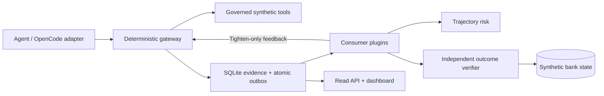

# Sentinel Interlock

[](https://github.com/HardCounter/Hack-Yeah-2026/actions/workflows/tests.yml)

**A policy gateway, audit pipeline, and independent outcome verifier for AI agents.**

Built by **HardCounter** for the Goldman Sachs AI Control Layer challenge at HackYeah 2026.
The working example is customer onboarding against a deterministic, fictional bank dataset.

An agent can make individually permitted tool calls and still produce the wrong business result.
Sentinel Interlock checks both the proposed interaction and the resulting database state:

1. **Authorize before dispatch:** deterministic tool, target, signature, model, and resource checks.
2. **Record and supervise:** sanitized SQLite evidence, durable consumer delivery, and trajectory risk.
3. **Verify the outcome:** compare persisted business state, screening evidence, and effect receipts
   against an externally defined Task Contract.

The controlled tool path runs outside the model. Coverage depends on routing operations through
that path; this demonstration does not provide an OS sandbox or comprehensive protection for
arbitrary MCP servers and external APIs. See [security boundaries](SECURITY.md).

## Try it without a model

Requirements: **uv** and Python **3.12** (the code supports 3.11+). **Node.js 22+** is needed for
the complete test suite, but not for the scripted demonstration. No provider credentials or Docker
are required. Run these commands from the repository root:

```sh
uv sync --locked
uv run --locked python data/generate.py
uv run --locked python simulation/agent.py APP-0001 --driver scripted
```

Expected result: `VERDICT   VERIFIED_SUCCESS`. The generator checks byte-for-byte determinism
and creates 17 onboarding cases. Each default agent run copies the synthetic bank into an isolated
run directory; generated datasets and execution artifacts are ignored by Git.

Now skip sanctions screening:

```sh
uv run --locked python simulation/agent.py APP-0003 --driver scripted --fault skip_step:screen_sanctions
```

This negative scenario exits with status **1**, cannot create the client, and does not report verified
success. A blocked unsafe action does not complete the task.

### Explore the dashboard offline

```sh
uv run --locked python -m web.demo --port 8000
```

Open **http://127.0.0.1:8000**. The dashboard reads actual governed SQLite evidence from two newly
generated sessions, including verification results, risk decisions, metrics, and audit exports.
The Tests tab runs local controls with stub models. Live agent sessions and configuration writes
are disabled in this mode. All state is temporary and removed when the server exits.

To keep evidence and explore the API separately:

```sh
uv run --locked python -m persistence.http_api.demo --port 8790
```

This prints session IDs, the evidence directory, and `curl` examples. API documentation is available
at **http://127.0.0.1:8790/api/v1/docs**. Explicit `--example-mode` is separate from persisted evidence.

## Architecture



| Component | Engineering responsibility |
|---|---|
| `contracts/` | Shared action, Task Contract, decision, verification, and feedback models |
| `intercept/`, `plugins/` | Deterministic admission, transformed-payload revalidation, prompt inspection, resource controls |
| `configuration/` | Authenticated policy edits, cross-process locking, saved revisions and pinned active snapshots |
| `persistence/` | SQLite WAL, transactional evidence/outbox writes, leases, retries, dead letters, scoped reads and exports |
| `consume_plane/` | Plugin isolation, per-session ordering, trajectory analysis, outcome verification, optional semantic judge |
| `adapters/opencode/` | Minimal JavaScript shim for OpenCode's plugin runtime; policy remains in Python |
| `simulation/`, `data/` | Scripted and model-driven KYC workflows, 10 KYC tools and 6 bait tools, deterministic fixtures |
| `web/`, `static/` | FastAPI operator application, live session lifecycle, test runner, evidence dashboard |
| `scripts/`, `tests/` | Reproducible runners and unit, integration, fault, concurrency, and end-to-end tests |
| `infra/`, `compose.yaml` | Optional AWS demo infrastructure and Caddy/app/read-API deployment |

The audit store sanitizes interaction payloads into structured metadata. Its outbox provides
**at-least-once delivery**, with deduplication at consumer boundaries. Hashes and transactional
conflict checks support evidence integrity; a local SQLite file is not tamper-proof against its owner.
Pagination holds protect active scoped reads from retention; content bodies share the event byte quota.

## Implemented scope and limits

| Capability | Current behavior |
|---|---|
| Tool authorization | Governed synthetic tool dispatch checks policy and the pinned task scope before execution |
| Prompt enforcement | Local Python dispatch inspects requests and completions. The OpenCode adapter sends full normalized context/system text for Python admission; real hook failure propagation remains unverified |
| Bounded inspection | Truncated/omitted content, including unsupported media, fails closed in enforcement mode. Private reasoning is excluded from inspection |
| Budgets | Conservative request/token reservations and tool-call limits; positive unsupported monetary budgets fail closed |
| Trajectory risk | Configured noisy-OR behavioral signals and expected loss; this is a heuristic, not a calibrated incident probability |
| Outcome verification | Independent reads of synthetic bank state, action provenance, screening digests and effect receipts |
| Semantic supervision | Optional consume-plane goal-alignment judge. Layer 1 semantic-guard configuration is reserved, not an active classifier |
| Human approval | Approval-required execution fails closed; no interactive approval queue is implemented |
| Dashboard | Persisted risk, verification, detections, aggregate metrics and audit exports; absent measurements remain unavailable |
| Runtime integration | OpenCode 2.0.22 is the demonstrated adapter target. Synthetic hook tests do not prove every real runtime hook or completion path |

The system does not claim live banking integration, production AML coverage, automatic rollback,
universal prompt-injection prevention, or exactly-once external side effects.

## Verify the project

```sh
uv run --locked ruff check .
uv run --locked pytest -q
node --experimental-vm-modules --test tests/frontend/dashboard.test.mjs adapters/opencode/test.mjs adapters/opencode/forward.test.mjs
```

On Linux/macOS or WSL, `scripts/test.sh all` runs the same Python correctness checks, Python suite,
adapter tests, and frontend tests. Native Windows can use the direct commands above; POSIX-only
checks are marked accordingly. [CI](.github/workflows/tests.yml) runs the Python and Node suites
on Linux, Windows, and macOS, and builds the Docker image on Linux.

Optional live-provider tests require `RUN_LLM_TESTS=1` and a configured provider. Real OpenCode
pipeline tests require its CLI and use a loopback fixture model. See the dated
[repository review and verification record](docs/project-review.md) for exact local results and exclusions.

## Run a live agent or deploy the demo

For the OpenCode runner, install the pinned CLI and set your provider credentials in the process
environment, then choose an explicit `provider/model`:

```sh
scripts/setup_opencode_pipeline.sh
scripts/run_pipeline.sh APP-0001 --model provider/model
```

Managed `standard` policy intentionally requires approval for client creation and therefore fails
closed on that step. The offline scripted workflow uses its own explicit synthetic demo policy.
Live model behavior may produce a failed or incomplete verification result.

For Docker, copy `.env.example` to the ignored `.env`, configure the desired provider/model, and
set `CONFIG_ADMIN_TOKEN` to enable policy editing:

```sh
cp .env.example .env
docker compose up -d --build
```

The dashboard is served at **http://localhost** and the agent console at **/opencode-wrapper/**.
The app, read API and Caddy share a persistent data volume. Configuration authentication does not
provide user authentication for the entire deployment. Review [deployment boundaries](SECURITY.md)
and the [deployment runbook](docs/dashboard/deployment.md) before exposing it publicly.

## Documentation

- [Contributor setup and checks](CONTRIBUTING.md) · [Security boundaries](SECURITY.md) · [Dependency inventory](THIRD_PARTY.md)
- [Current repository review](docs/project-review.md) · [Integrated runtime](docs/integrated-runtime.md) · [Scripts](scripts/README.md)
- [Architecture contract](docs/architecture-contract.md) · [Persistence](docs/persistence.md) · [REST API](docs/rest.md)
- [Decision traces](docs/decision-trace.md) · [Trajectory risk](docs/trajectory-risk-model.md) · [Event envelope](docs/consumer-plane-event-envelope.md)
- [Design direction](docs/project-direction.md) · [Consumer design](docs/consumer-plane.md) · [Future roadmap](CODE_IMPROVEMENT_ROADMAP.md)
- [Challenge rules](docs/goldman/GoldmanSachsRules.md) · [Challenge criteria](docs/goldman/GoldmanSachsCriteria.md)
- [Team presentation](presentation/HackYeah2026-HardCounter.pdf)

Design documents and historical test counts describe their stated revision; the current review records
what was checked on this branch. This is a team project. A project license has not yet been selected.
