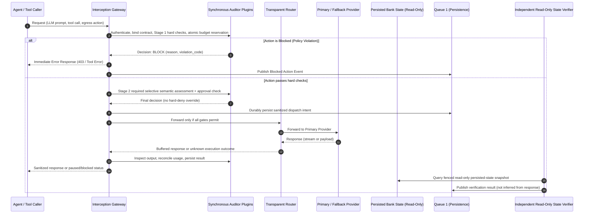
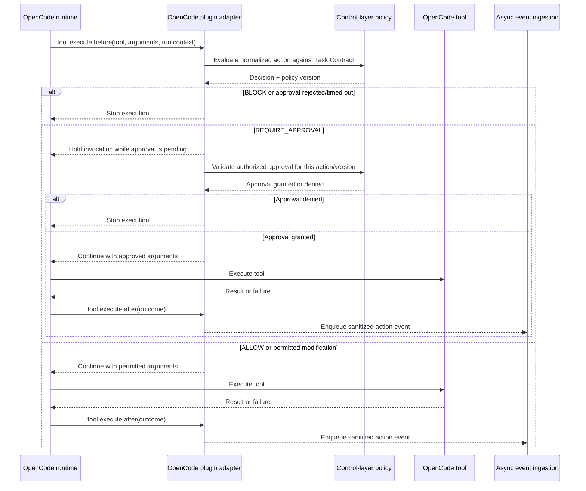
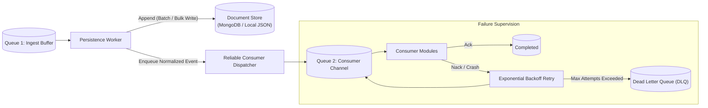
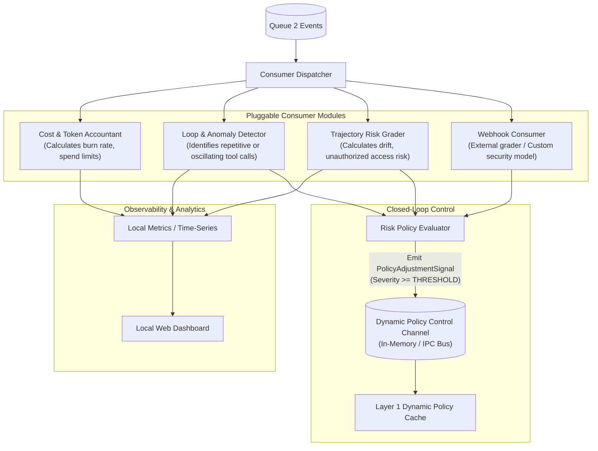

# Local Agent Gateway & Control Plane: Architecture

Status: **proposed interfaces, not implemented**. The MVP is one KYC workflow; AML,
multi-provider fallback, arbitrary plugins and broad protocol support are deferred.
[architecture-contract.md](architecture-contract.md) defines the required trust,
decision, persistence and verification boundaries. Examples below are not runtime evidence.
Python development uses **uv**, `pyproject.toml`, committed `uv.lock`, and the Python 3.12 pin.

A lightweight, locally runnable **interception, persistence, and consumer gateway** designed to run on the same system (or sidecar) as the agentic loop. 

Unlike heavy distributed enterprise platforms, this architecture provides a **clean, modular, and maintainable local control layer** that unifies:
1. **Synchronous Action Interception & Auditing** (inspect, evaluate, block, or transparently route LLM and MCP/tool actions).
2. **Durable Sanitized Evidence** (critical intent/decision persistence before dispatch, atomic business effect receipts, durable outbox delivery to asynchronous analytics).
3. **Selective Pre-Action Supervision and Independent Verification** (semantic gates before high-impact operations; read-only persisted-state checks afterwards). Async consumers provide reporting and explicit restrictions on later actions, not retroactive prevention.

---

## 1. Core Architectural Overview

The system operates across three tightly scoped layers connected by asynchronous queues and a dynamic policy feedback channel:

```mermaid
flowchart TB
    subgraph LOCAL_HOST["Local Host / Agent Environment"]
        subgraph AGENT_ENV["Agent Execution Plane"]
            AGENT["OpenCode Runtime<br/>(initial planned integration)"]
            OCADAPTER["OpenCode Plugin Adapter<br/>(tool-execution hooks)"]
            AGENT <--> OCADAPTER
        end

        subgraph LAYER1["Layer 1: Interception Layer (Gateway & Policy Guard)"]
            direction TB
            ENTRY["Gateway Listener<br/>(LLM HTTP / MCP JSON-RPC / Tool Proxy)"]
            AUDIT_PIPE["Synchronous Policy Pipeline<br/>(In-Process Callbacks & Webhook Auditors)"]
            ROUTER["Policy-Checked Router<br/>(No Side-Effect Fallback)"]
            UPSTREAM[("Configured Upstream<br/>LLM Providers / MCP Servers")]
            PACKER["Event Normalizer & Packager"]
            Q1[("Queue 1: Durable Sanitized Outbox")]

            ENTRY --> AUDIT_PIPE
            AUDIT_PIPE -- "BLOCK / REJECT" --> ENTRY
<<<<<<< HEAD
            AUDIT_PIPE -- "ALLOW after required semantic/approval gate + durable intent" --> ROUTER
=======
            AUDIT_PIPE -- "ALLOW" --> ROUTER
            OCADAPTER -- "Tool action" --> AUDIT_PIPE
            AUDIT_PIPE -- "Decision / approval state" --> OCADAPTER
            OCADAPTER --> PACKER
>>>>>>> origin/main
            ROUTER <--> UPSTREAM
            ROUTER --> PACKER
            PACKER --> Q1
        end

        subgraph LAYER2["Layer 2: Persistence Layer (Document Store & Reliable Dispatcher)"]
            direction TB
            PERSIST_WORKER["Persistence Worker"]
            DOC_STORE[("Document Store<br/>(MongoDB / JSON Append Store)")]
            Q2_DISPATCHER["Consumer Dispatcher & Retry Supervisor"]
            Q2[("Queue 2: Consumer Queue<br/>(With Exponential Retries & DLQ)")]

            Q1 --> PERSIST_WORKER
            PERSIST_WORKER --> DOC_STORE
            PERSIST_WORKER --> Q2_DISPATCHER
            Q2_DISPATCHER --> Q2
        end

        subgraph LAYER3["Layer 3: Consumer Layer (Risk Intelligence & Observability)"]
            direction TB
            CONSUMER_RUNTIME["Consumer Manager"]
            subgraph PLUGINS["Pluggable Consumer Modules"]
                P_METRICS["Metrics & Cost Observer"]
                P_LOOP["Loop & Anomaly Detector"]
                P_RISK["Trajectory Risk Grader"]
                P_CUSTOM["Custom Webhook / Callback"]
            end
            SINKS["Observability Sinks<br/>(Dashboard / Logs / Exports)"]
            FEEDBACK_GEN["Policy Feedback Controller"]

            Q2 --> CONSUMER_RUNTIME
            CONSUMER_RUNTIME --> PLUGINS
            PLUGINS --> SINKS
            P_RISK & P_LOOP --> FEEDBACK_GEN
        end

        FEEDBACK_GEN -. "Audited Restriction/Halt Intervention<br/>(Cannot Relax Pinned Contract)" .-> AUDIT_PIPE
    end

    AGENT <-->|Optional provider/MCP proxy path| ENTRY
```

The OpenCode plugin path and the optional HTTP/MCP gateway path are distinct. The plugin sends hooked tool actions to policy and receives a decision; it does not imply that OpenCode provider traffic or all operating-system effects pass through the gateway.

### Architectural Highlights

- **Local-First & Resource-Lean:** Runs as an embedded process or lightweight local daemon on the agent's host. No heavy distributed message brokers (Kafka/Zookeeper) or multi-tier object storage clusters required.
- **Fail-Closed Critical Path:** Fast deterministic checks precede selective semantic gates, approvals and durable intent persistence. Measure latency; do not remove safety checks to promise zero overhead.
- **Pre-Action and Post-Action Separation:** Async feedback tightens later calls only. Independent verification reads bank state through a trusted read-only path, not just the document/event store.

---

## 2. Layer 1: Interception Layer (Gateway & Policy Enforcement)

The planned Interception Layer authenticates and scopes proposals, performs synchronous
hard/semantic/approval gates, reserves resources, routes permitted requests and inspects
outputs. Critical evidence is durable before high-impact dispatch. Protocol breadth and
provider fallback remain deferred; no running intermediary exists yet.



The architecture supports three separate interception boundaries; a deployment does not automatically cover all of them:

1. **MVP LLM Proxy:** Exposes standard OpenAI (`/v1/chat/completions`) compatible endpoint with buffered output inspection before agent delivery. Anthropic and unchecked SSE streaming are deferred.
2. **MVP Tool Gateway / OpenCode Plugin Adapter:** An authenticated tool execution endpoint and OpenCode plugin hook adapter for scoped KYC and fake bait calls; tests and dashboard use the same path. Protocol-level MCP proxy is deferred.
3. **Containment & Egress:** Only the gateway has backend credentials and access to tools/writable data. Network/OS boundaries must deny direct agent access. An in-process wrapper on an unsandboxed agent alone is cooperative, bypassable instrumentation.

#### 2.1.1 Initial Runtime Adapter: OpenCode (Planned)

The OpenCode adapter is the runtime-specific edge of the control layer; policy evaluation and the Task Contract remain in the shared control plane. The first integration will use an OpenCode plugin's `tool.execute.before` and `tool.execute.after` hooks from the [OpenCode plugin API](https://opencode.ai/docs/plugins/), subject to compatibility testing against the pinned OpenCode version. The current development environment reports OpenCode `v2.0.22`; that version has not yet been validated with this adapter.

The enforcement described here applies only to actions that actually pass through the hooked OpenCode tool-execution path. A `bash` call exposes a command string, not a complete mediation point for all subprocess, filesystem, or network effects. Provider traffic needs a separately configured LLM proxy. MCP tools exposed through OpenCode must be checked to confirm the hook executes before their side effect; protocol-level MCP enforcement requires routing them through an MCP proxy. Direct routes, other plugins, or a disabled adapter may bypass these hooks. Where those paths matter, constrain credentials and OS/network access, and report any unmediated path as uncovered rather than claiming comprehensive protection. The [initial coverage inventory and acceptance plan](intercept/opencode-adapter-plan.md) records the planned scope; coverage remains unverified until the listed tests pass.

Before a hooked tool executes, the adapter will normalize its name and proposed arguments, attach trusted run/contract context available to the integration, and synchronously request a decision from the control layer. The shared policy evaluates task-scoped tool permissions, argument constraints, approvals, and run budgets, and returns the policy version used. Budget accounting and hard constraints remain deterministic and centralized; semantic supervision cannot override a deny, missing approval, or exhausted budget. The adapter must enforce hard policy constraints before execution:

- `ALLOW`: continue with the checked action.
- `BLOCK`: stop the invocation before the tool can run.
- `REDACT` / `MODIFY`: apply only an explicit policy-produced argument change supported by the OpenCode hook API.
- `REQUIRE_APPROVAL`: pause until an authorized approval is obtained for the specific action; approval is not an immediate allow.

After execution, the adapter will observe the tool outcome and send a sanitized event to the asynchronous ingestion path. Events should use an allowlist of necessary fields; raw arguments, tool results, authorization headers, and unbounded error text are excluded by default. Apply secret/PII scrubbing and bounded summaries before enqueueing. Policy evaluation remains synchronous; persistence must not delay the decision. The exact hook payload, supported argument mutation, blocking behavior, and any ability to alter results must be verified for the pinned OpenCode version. Do not claim output redaction if a hook can only observe the result; enforce it at a response boundary that supports modification.

Event enqueueing records an observed tool outcome; it is not independent outcome verification. For a workflow with side effects, a separate verifier must query trusted external state, check explicit postconditions (including uniqueness where needed), and distinguish verified success, failed postconditions, and verification that could not be completed.



Other agent runtimes may later use separate adapters to translate their hooks into the shared action and decision contracts. No other runtime adapter is part of the initial implementation scope.

### 2.2 Synchronous Action Auditing & Pluggable Policies

Before any action is sent to an external provider or executed on a tool, it passes through an extensible **Action Auditor Pipeline**.

#### The Decision Contract & Pipeline Precedence
Execution follows a strict two-stage pipeline:
- **Stage 1 (Deterministic Enforcers):** Evaluates allowlists, argument schemas, PII/secret regexes, and synchronous pre-dispatch budget reservations. Any hard `BLOCK` terminates execution immediately and skips all semantic checks.
- **Stage 2 (Selective Semantic & Approval Gates):** Evaluates contextual trajectory drift or human approval for high-impact actions. A semantic assessment can never override a Stage 1 hard deny, missing approval, or exhausted budget.

Each auditor returns a structured decision:
- `ALLOW`: The action complies with policies; forward immediately.
- `BLOCK`: The action violates policy; reject immediately and return a structured error to the agent.
<<<<<<< HEAD
- `REDACT`: Sanitize data before forwarding/delivery and revalidate. If a transformation alters approved baseline identity fields or financial amounts, the gateway converts it to a hard `BLOCK`.
- `REQUIRE_APPROVAL`: Pause with no dispatch. An authorized external reviewer grants a single-use approval bound to contract, action/arguments digest, policy, state version and expiry; recheck hard rules and budget before execution.
- `ALERT`: Allow the action to proceed, but emit a high-priority warning event to the dashboard and increase session risk score.
=======
- `REDACT`: Sanitize sensitive fields (e.g., tokens, PII) in arguments before forwarding.
- `REQUIRE_APPROVAL`: Pause execution until an external local confirmation is provided.
- `ALERT`: Emit a high-priority warning and increase session risk score. It is not authorization and never overrides another control; the action proceeds only if the resolved policy otherwise permits it.

The pipeline uses deterministic conflict resolution, not first-match allow: hard `BLOCK` (including exhausted budget) takes precedence over `REQUIRE_APPROVAL`, which takes precedence over `ALLOW`; `ALERT` is additive and never grants permission. Apply configured argument transformations in order, then re-run hard checks against the final payload before execution. Bind approval to the finalized action, run, policy version, and active intervention/overlay version; a changed action or applicable policy overlay invalidates the approval and requires a new decision. Record every auditor decision, including alerts and denials, in sanitized audit evidence.
>>>>>>> origin/main

#### Dual Plugin Delivery Mechanisms
Two future trusted plugin modes are proposed, not implemented. Plugin code/config is part
of the trusted control plane; agent inputs cannot choose handlers or endpoints:
1. **In-Application Callbacks (In-Process):** Fast, zero-overhead Python/Go functions implementing a standard `ActionAuditor` interface. Ideal for fast local regex, allowlists, argument bounds checking, and token budgets.
2. **Webhook Callbacks (HTTP/gRPC):** Authorized allowlisted endpoints receive only policy-permitted sanitized data, with authentication, bounded time/size and validated decision schemas. Mandatory callback failure blocks/pauses; never defaults to ALLOW. Sending private data externally requires approval.

#### Example Auditor Configuration (`gateway_config.yaml`)
```yaml
interception:
  port: 8080
  strict_mode: false # Pinned for each run; async feedback can only tighten via audited intervention
  
  auditors:
    # 1. In-process deterministic validator (ordered chain)
    - name: "tool-allowlist"
      type: "in_process"
      handler: "core.auditors.allowlist:ToolAllowlistAuditor"
      config:
        allowed_tools: ["read_application", "read_documents", "screen_sanctions", "create_client"]
        block_action: "reject"

    # 2. Secret & PII scanner
    - name: "credential-shield"
      type: "in_process"
      handler: "core.auditors.security:CredentialShieldAuditor"
      config:
        patterns: ["aws_secret", "private_key", "password"]

    # 3. External Webhook for complex or polyglot rule checks
    - name: "compliance-evaluator"
      type: "webhook"
      endpoint: "http://127.0.0.1:9090/audit/action"
      timeout_ms: 150
```

#### Dynamic Configuration Hot-Reloading
The policy engine continuously monitors the centralized policy file (e.g. `gateway_config.yaml` / `policy.yaml`) for file modification events (via inotify / file watcher). When configuration files are modified (e.g. judges adjusting thresholds, toggling allowlists, or updating token budgets during evaluation):
- Updated policies are immediately validated against schemas and swapped in-memory. Invalid or partially written configuration is rejected; the last valid snapshot remains active and a sanitized reload-failure event is emitted.
- A validated policy snapshot is atomically activated for new runs and new sessions; each in-flight run remains bound to the pinned policy version in its Task Contract.
- Any authorized emergency tightening for an in-flight run is an explicit, scoped, versioned, monotonic overlay/intervention; it may tighten or pause, but never relax the run's bound hard constraints. Record its issuer, scope, reason, lifetime, and intervention ID. Re-evaluate affected pending actions and invalidate approvals that no longer match the active policy/overlay versions.
- A `policy_reloaded` event records the old and new content-hashed policy version hashes and activation outcome.

### 2.3 Backend Routing & Deferred Fallback

The future routing layer decouples agent proposals from trusted backend configuration.
The following multi-provider example is deferred, not part of the first KYC slice:

- **Provider Routing:** Maps abstract model names requested by the agent (e.g., `primary-reasoning-model`) to specific backends (e.g., local Ollama, vLLM, Anthropic, OpenAI).
- **LLM Fallback (deferred):** Recheck allowed model, destination/data flow and atomic budget reservation for every attempt. Unknown timeout usage is conservatively charged. No bypass through a fallback provider.
- **Tool Routing:** Never automatically retry/fail over a side-effecting tool. On ambiguous timeout, reconcile persisted state by original action/business key before any retry; conflicting retries are rejected. MCP transport breadth is deferred.

```yaml
routing:
  llm:
    providers:
      anthropic_primary:
        type: "anthropic"
        base_url: "https://api.anthropic.com"
        api_key_env: "ANTHROPIC_API_KEY"
      ollama_local_fallback:
        type: "openai_compatible"
        base_url: "http://127.0.0.1:11434/v1"
        api_key_env: "EMPTY"

    routes:
      "claude-3-5-sonnet":
        primary: "anthropic_primary"
        fallback: "ollama_local_fallback"
        timeout_seconds: 30
        retry_on_status: [429, 500, 502, 503, 504]
```

### 2.4 Event Packaging & Queue Handoff

Once an action completes (or is blocked), the gateway packages the complete interaction into an **Application-Level Action Event** and asynchronously enqueues it into `Queue 1`. 

**Critical Invariant:** High-impact dispatch waits for a durable sanitized intent/decision;
business writes atomically persist effect receipts and uniqueness constraints. Async
analytics uses a durable outbox, not an evidence-loss-prone memory buffer. Bound queues and
retries; pause writes if durable evidence cannot be stored. Persist blocked attempts too.

---

## 3. Layer 2: Persistence Layer (Document Store & Queueing Pipeline)

The Persistence Layer ensures that every action is reliably preserved for local querying and auditing, while safely decoupling storage workloads from asynchronous consumer processing.



### 3.1 Document Store (MongoDB / Append-Optimized Store)

The final storage choice is open; SQLite is sufficient for a small local slice. Only
sanitized allowlisted event fields are persisted, not arbitrary raw prompts/arguments/results.
MongoDB is an optional future choice, not an installed dependency. JSON-oriented storage can offer:
1. **Flexible Sanitized Document JSON:** Persists allowlisted, sanitized structured events and metadata without complex relational migrations, strictly excluding raw secrets, unchecked PII, and raw prompt blobs.
2. **High-Throughput Append Workloads:** MongoDB handles rapid append-only writes via time-bucketed collections or capped collections with minimal write latency.
3. **Rich Local Querying:** Easily query action histories by session, trace, tool name, or risk attributes for local debugging and dashboard exploration.

#### Indexing Strategy
```javascript
// Primary query patterns for local observability
db.agent_actions.createIndex({ "trace_id": 1, "ts": 1 });
db.agent_actions.createIndex({ "session_id": 1, "ts": 1 });
db.agent_actions.createIndex({ "action_type": 1, "status": 1 });
db.agent_actions.createIndex({ "risk_metadata.risk_level": 1 });
```

### 3.2 Reliable Queue 2 & Consumer Supervision

After the persistence worker commits an event to the document store, it pushes the event to **Queue 2** for downstream evaluation:
- **Decoupled Analytics:** Ordinary metric consumer failure need not halt the gateway. Failure of a required synchronous semantic gate or durable critical evidence is different and blocks/pauses dispatch.
- **At-Least-Once Delivery:** Events in Queue 2 require explicit consumer acknowledgment (`ACK`).
- **Idempotent Analytics:** Deduplicate by event ID; a replayed analytics event never repeats a business action. Recover dispatch from the durable outbox after crashes.
- **Retry Mechanism with Exponential Backoff:** If a consumer fails or times out (e.g., an external webhook consumer is temporarily unreachable), the dispatcher retries delivery with jittered exponential backoff.
- **Dead Letter Queue (DLQ):** Messages exceeding `max_retries` are moved to a local dead-letter store for offline inspection without stalling the consumer pipeline.

---

## 4. Layer 3: Consumer Layer (Risk Intelligence & Feedback Control)

The Consumer Layer executes in the background. It consumes persisted events from Queue 2, calculates rolling metrics, evaluates agent behavior across multiple steps, and—critically—**exerts dynamic feedback control back onto Layer 1**.



### 4.1 Pluggable Consumer Modules

Consumers are designed as isolated, plug-and-play plugins implementing an asynchronous processor interface:
- **In-Process Modules:** Python/Go worker coroutines that run in the background consumer process.
- **Webhook Consumers:** HTTP endpoints that receive streaming batches of events, allowing external tools, evaluation frameworks, or specialized microservices to analyze traces.

#### Reference Consumer Implementations
1. **Loop & Oscillation Observer:** Tracks repetitions and requests later restrictions. Hard tool-call ceilings and structurally detectable loops run synchronously in Layer 1.
2. **Trajectory & Drift Grader:** Analyzes the sequence of actions against the expected workflow or contract. Detects deviations (e.g., agent was tasked with data retrieval but suddenly attempts file deletion or network discovery).
3. **Spend & Velocity Observer:** Reports burn rate. Layer 1 enforces protected atomic reservations for token/cost/time/tool/concurrency ceilings before calls, including local-model and semantic work, retries and unknown usage. Async accounting alone cannot enforce a hard budget.

### 4.2 Dynamic Feedback Loop: Influencing the Interception Layer

Traditional observability is purely passive; by the time a human reads a dashboard, the agent has already executed unwanted actions. 

This architecture introduces a **closed-loop feedback mechanism**:
1. When a consumer (e.g., `Trajectory Risk Grader` or `Loop Detector`) identifies suspicious, risky, or anomalous behavior, it synthesizes a **`PolicyAdjustmentSignal`**.
2. The signal is dispatched over a local fast IPC channel (in-memory state, local event bus, or unix domain socket) to the Interception Layer's **Dynamic Policy Cache**.
3. Layer 1 authenticates and durably records the restriction intervention for the affected
   contract/run, then applies it to subsequent dispatch checks. It does not replace the
   pinned policy, weaken constraints, reset spend or retroactively prevent prior actions:
   - **Enforce Strict Allowlist:** Disable optional or potentially dangerous tools.
   - **Enforce Human Approval:** Convert automatic tool execution into `REQUIRE_APPROVAL` mode.
   - **Throttle / Halt:** Add synthetic delay or request session-level halt (synchronous budget limits are enforced at Layer 1 pre-dispatch).
   - **Hard Halt:** Issue a session-wide `BLOCK` for all subsequent LLM or tool requests.

```json
// Example: PolicyAdjustmentSignal emitted by Trajectory Risk Grader
{
  "signal_id": "sig_01J9ZK49B...",
  "contract_id": "contract_onboarding_APP0001",
  "policy_version": "sha256:example-policy",
  "ts": "2026-10-03T15:45:00.120Z",
  "target_scope": {
    "session_id": "sess_onboarding_APP0001",
    "agent_id": "onboarding-agent"
  },
  "action": "ESCALATE_POLICY",
  "policy_modifications": {
    "strict_mode": true,
    "require_approval_for": ["create_client"],
    "blocked_tools": ["run_code", "delete_client", "send_email"]
  },
  "reason": "Anomalous tool call velocity detected (5 attempts in 2 seconds) with parameter drift.",
  "ttl_seconds": 600
}
```

---

## 5. Unified Data Contracts & Interfaces

To maintain clean separation and make the system truly extendable, all components communicate via standardized schemas and programming interfaces.

### 5.1 Application Action Event Envelope (Stored in DB & Queues)

This illustrative envelope is not a license to store raw payloads. Persist only allowlisted metadata and sanitized, bounded summaries by default; exclude raw arguments/results, credentials, authorization headers, and unbounded error text unless a separately approved retention policy explicitly permits a redacted form.

```json
{
  "schema_version": "proposed-1.0",
  "event_id": "evt_01J9ZK3Q8W2M5N7R4T6V8X0Y1A",
  "run_id": "run_0042",
  "contract_id": "contract_0042",
  "action_id": "action_0004",
  "policy_version": "sha256:example-policy",
  "feed_version": "sha256:example-feed",
  "trace_id": "tr_4bf92f3577b34da6a3ce929d0e0e4736",
  "session_id": "sess_onboarding_APP0001",
  "case_id": "APP-0001",
  "agent_id": "onboarding-agent",
  "ts": "2026-10-03T15:42:10.500Z",
  "task_contract_id": "contract_APP0001_v1",
  "policy_version": "sha256:synthetic-policy-hash",
  "action_type": "tool_call", 
  "source": "opencode_plugin_adapter",
  "status": "completed", 
  
  "action_details": {
    "name": "create_client",
    "parameters_summary": {
      "application_id": "APP-0001",
      "sanitized_name": "Jan Nowak"
    },
    "result": {
      "effect_receipt_id": "effect_0001",
      "created_client_id": "CLI-0151",
      "status": "created",
      "created_at": "2026-10-03T15:42:10Z"
    }
  },

  "interception_metadata": {
    "auditor_decisions": [
      {
        "auditor": "credential-shield",
        "decision": "ALLOW",
        "latency_ms": 0.8
      }
    ],
    "routed_upstream": null,
    "fallback_triggered": false,
    "interception_overhead_ms": 1.2
  },

  "metrics": {
    "input_tokens": 450,
    "output_tokens": 85,
    "latency_ms": 142.5,
    "tool_calls_used": 4,
    "tool_call_budget": 30
  },

  "risk_metadata": {
    "initial_score": 0.15,
    "flagged_by_feedback": false
  }
}
```

### 5.2 Layer 1: Synchronous Auditor Plugin Interface

Any custom audit plugin (in-process or webhook) adheres to this simple contract:

```python
from typing import Protocol, Literal
from dataclasses import dataclass

@dataclass
class AuditContext:
    trace_id: str
    session_id: str
    agent_id: str
    action_type: Literal["llm_call", "tool_call", "mcp_tool", "egress_http"]
    action_name: str
    payload: dict
    current_policy_level: str  # "standard", "strict", "quarantine"
    task_contract: dict  # Mandatory, loaded from protected server-side contract registry
    policy_version: str  # Immutable snapshot bound at session start
    action_id: str  # Gateway-issued identity; not supplied as authority by the model

@dataclass
class AuditDecision:
    decision: Literal["ALLOW", "BLOCK", "REDACT", "REQUIRE_APPROVAL", "ALERT"]
    reason: str | None = None
    violation_code: str | None = None
    modified_payload: dict | None = None

class ActionAuditorPlugin(Protocol):
    """Interface for synchronous Layer 1 policy auditors."""
    
    def evaluate(self, ctx: AuditContext) -> AuditDecision:
        """Returns evidence/decision; semantic plugins are not deterministic hard checks."""
        ...
```

### 5.3 Layer 3: Consumer Plugin Interface

```python
from typing import Protocol
from dataclasses import dataclass

@dataclass
class ConsumerContext:
    consumer_name: str
    feedback_bus: "FeedbackControlChannel"

class ConsumerModule(Protocol):
    """Interface for asynchronous Layer 3 observers and risk graders."""
    
    def setup(self, ctx: ConsumerContext) -> None:
        """Initialize local state, thresholds, or models."""
        ...
        
    def process_event(self, event: dict, ctx: ConsumerContext) -> None:
        """
        Process persisted action event.
        Can emit metrics, store derived observations, or trigger dynamic feedback.
        """
        ...
        
    def teardown(self) -> None:
        """Flush state and cleanup resources."""
        ...
```

### 5.4 Gateway-Dashboard API Contract (for Judge UI)

To power the judge-facing audit ledger UI defined in `docs/dashboard-ui.md`, the Gateway exposes the following lightweight HTTP/SSE endpoints:

| Endpoint | Method | Purpose | Payload / Response |
|---|---|---|---|
| `/api/v1/inspect` | `POST` | **Sandbox Attack Console**: Uses the same enforcement path; identity/contract/policy are resolved server-side. | Req: prompt or tool proposal plus session reference (no self-selected authority). Res: sanitized verdict/pipeline/output, action ID and bound policy version. |
| `/api/v1/events/stream` | `GET` | **Live Feed**: Server-Sent Events (SSE) streaming decisions in real-time. Excerpts are sanitized/masked. | `data: {"event_id": "...", "ts": "...", "verdict": "BLOCKED", "rule": "ONB-P1", "excerpt": "[REDACTED_DATA]", "latency_ms": 1.2}` |
| `/api/v1/policy` | `GET` | **Policy Inspector**: Returns current policy version, loaded rules, and strictness mode. | `{"version": "v12", "mode": "strict", "rules_count": 18, "last_reloaded": "..."}` |
| `/api/v1/policy/mode` | `POST` | **Admin-only Strictness Toggle**: Publishes a validated version for new sessions; active contracts stay pinned. | Requires `Authorization: Bearer <ADMIN_SECRET>`. Req: `{"mode": "lenient"|"standard"|"strict"}`. Res: `{"status": "ok", "active_mode": "strict", "version": "v13"}`. Public demo users cannot mutate global policy. |
| `/api/v1/approvals/{approval_id}/decide` | `POST` | **Human Approval Decision**: Authorized compliance reviewer records decision for paused action. | Requires `Authorization: Bearer <ADMIN_SECRET>`. Req: `{"decision": "ALLOW"|"BLOCK", "canonical_arguments_sha256": "...", "single_use_nonce": "..."}`. Consumes nonce atomically upon re-checked dispatch. |
| `/api/v1/suite/status` | `GET` | **Test Suite Strip**: Returns actual executed results, never scenario-table counts. | Before tests exist: `{"status": "not_run", "total": null, "passed": null}`. Later include commit, policy/feed versions, command, timestamp and positive-case counts. |
| `/api/v1/scenario/replay` | `POST` | **Sandbox Outcome Replay**: Verifies a preserved bank-state snapshot and baseline through a read-only path. | Scenario/snapshot IDs, per-check evidence and `VERIFIED_SUCCESS`, `FAILED_POSTCONDITIONS` or `VERIFICATION_INCOMPLETE`; no claim a completed write was blocked. |

---

## 6. Operability & Local Deployment Model

The architecture is designed to be set up on a developer's machine in minutes, without requiring cloud accounts or complex orchestrators.

### 6.1 Local Architecture Topology (illustrative; not a containment proof)

```
+--------------------------------------------------------------------------+
| Single Local Host / Developer Machine                                   |
|                                                                          |
|  [Agent Process]  (Python / Node / AutoGen / LangGraph / Claude Code)    |
|        │                                                                 |
|        ▼ (localhost:8080)                                                |
|  +────────────────────────────────────────────────────────────────────+  |
|  | Local Control Gateway Process                                      |  |
|  |  ├── Interception Engine (FastAPI / ASGI / Go Daemon)               |  |
|  |  ├── In-Process Policy Registry & Dynamic Policy Cache             |  |
|  |  ├── Transparent LLM & MCP Provider Routing Table                 |  |
|  |  └── Queue 1 Ingestion Buffer (In-memory ring / SQLite / Redis)    |  |
|  +────────────────────────────────────────────────────────────────────+  |
|        │                                                                 |
|        ▼                                                                 |
|  +────────────────────────────────────────────────────────────────────+  |
|  | Local Persistence Worker                                            |  |
|  |  ├── Appends to Local MongoDB (localhost:27017)                    |  |
|  |  └── Feeds Queue 2 (with backoff & Dead-Letter Queue)              |  |
|  +────────────────────────────────────────────────────────────────────+  |
|        │                                                                 |
|        ▼                                                                 |
|  +────────────────────────────────────────────────────────────────────+  |
|  | Consumer & Risk Intelligence Daemon                                 |  |
|  |  ├── Metric Aggregators & Cost Sinks                               |  |
|  |  ├── Trajectory Anomaly & Loop Detectors                           |  |
|  |  └── Feedback Signal Bus ───[IPC Socket / Shared Memory]───► (Cache)|
|  +────────────────────────────────────────────────────────────────────+  |
|        │                                                                 |
|        ▼                                                                 |
|  [Local Web UI / Observability Dashboard] (localhost:3000)               |
+--------------------------------------------------------------------------+
```

### 6.2 Deployment Options

| Mode | Target Use Case | Components | Setup Simplicity |
|---|---|---|---|
| **Local Daemon (planned)** | Small KYC slice | Gateway and analytics plus durable local store; separate read-only verifier path | Startup command not implemented; Python environment managed by uv |
| **Docker Compose (deferred)** | Future reproducible demo | Pin versions and explicitly restrict credentials, volumes and network egress | No compose file or tested isolation yet |
| **Sidecar (deferred)** | Future container deployment | Separate gateway authority plus explicit backend/network access controls | Sidecar/localhost alone is not isolation or production readiness |

---

## 7. Extensibility & Development Guide

### How to Add a New Auditor Plugin to Layer 1
1. **Implement the contract:** Write a class fulfilling `ActionAuditorPlugin` (or expose a simple HTTP POST endpoint returning JSON).
2. **Register in configuration:** Add the plugin entry to `gateway_config.yaml` under `interception.auditors`.
3. **Specify behavior on violation:** Choose whether to `BLOCK` (drop action and return error) or `REDACT` (cleanse arguments).

### How to Add a New Risk Grader with Feedback to Layer 3
1. **Implement `process_event`:** Track relevant historical actions for the session in memory or local cache.
2. **Calculate risk heuristic:** Check for anomalous behavior (e.g., unexpected arguments, forbidden transitions).
3. **Request restriction:** Call the future feedback interface with contract/policy references. Only authenticated, audited tightening/halt is permitted; Layer 1 performs required pre-action semantic gates independently.

---

## 8. Summary Comparison: Enterprise Spec vs. Local Gateway

| Dimension | Previous Enterprise Spec | Refocused Local Gateway Architecture |
|---|---|---|
| **Deployment Target** | Distributed cloud cluster (K8s, Kafka, S3, ClickHouse) | **Locally run gateway/proxy** on the same host as the agentic loop |
| **Interception Role** | Passive observation (post-hoc monitoring, streaming tee) | **Active Control**: Synchronous auditing, in-process/webhook policy guards, action blocking |
| **Backend Routing** | Simple passthrough | **Policy-checked routing**; LLM fallback deferred, no blind side-effect retries |
| **Persistence** | Multi-tier (WAL -> Broker -> S3 Parquet -> ClickHouse) | **Durable local store/outbox**, sanitized events and atomic business receipts; implementation choice open |
| **Consumer Execution** | Distributed consumer groups on Kafka | **Supervised Local Queue 2** with exponential backoff & DLQ |
| **Observability -> Control** | One-way pipeline (observe only) | **Selective synchronous gate + audited later restrictions**, not silent contract rebinding |

## 9. Independent completion check

The verifier is not an event consumer that infers success from `action_details.result`.
It reads a fenced consistent bank-state snapshot with a separate read-only credential,
compares persisted KYC identity/status/linkage/counts with the protected initial baseline,
and separately checks required screening/provenance evidence. Atomic uniqueness is by
application across sessions, not an agent-selected idempotency key. Missing evidence,
ambiguous writes, incompatible schema or verifier errors report `VERIFICATION_INCOMPLETE`.
An observed mismatch reports `FAILED_POSTCONDITIONS`, not BLOCK. The runtime schema and
verifier are not implemented; see `architecture-contract.md` sections 4–6 for requirements.
