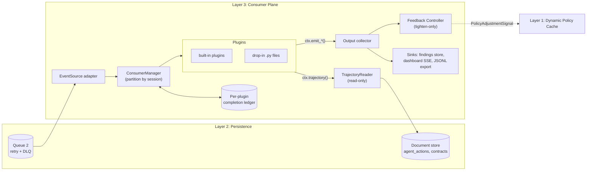

# Consumer Plane: Design and Implementation Plan

> Current integration: [integrated-runtime.md](integrated-runtime.md). The canonical consumer
> wire contract is Event Envelope v2.1 and decisions are ALLOW/BLOCK/REDACT/
> REQUIRE_APPROVAL/ALERT. Older v1/v2.0 examples, uppercase storage enums and
> standalone/unwired status notes below are historical design or internal formats;
> they do not define additional supported external contracts.

Detailed design for **Layer 3 (Consumer Layer)** of `docs/application-documentation.md`. It refines
sections 4 and 5.3 of that document into concrete contracts, a package layout, and a build plan.

**Status (2026-10-03): phase 0 and the core of phase 1 are implemented** in `consume_plane/`
(see [consumer-plane-implementation-notes.md](consumer-plane-implementation-notes.md) for what is
built, decisions taken, and deviations). The wire format is specified in
[consumer-plane-event-envelope.md](consumer-plane-event-envelope.md). The persistence layer
(Layer 2) is not implemented, so every dependency on it is a protocol with in-memory and JSONL
adapters.

---

## 1. Scope

### 1.1 What the consumer plane does

1. **Receives** persisted agent-action events from Queue 2 (at-least-once, ack/nack).
2. **Dispatches** each event to every plugin that subscribed to it.
3. **Gives plugins read-only access to the trajectory**: the ordered history of actions in the same
   session, plus the session's Task Contract, read from the persistence layer.
4. **Collects plugin outputs**: findings (alerts), metrics, and policy adjustment proposals.
5. **Forwards outputs**: findings and metrics to sinks (document store, dashboard SSE, audit export);
   policy proposals through a tighten-only Feedback Controller to Layer 1.

### 1.2 What it does not do

- It is **not on the hot path**. It cannot stop the action it is looking at; that action already
  happened (or was already blocked) by the time the event reaches Queue 2. Feedback affects only
  *later* actions. Any control that must prevent an action belongs in Layer 1.
- It **never relaxes policy**. A plugin can propose stricter rules; it can never override a Layer 1
  hard deny, a missing approval, or an exhausted budget.
- It does **not write to the agent action log**. Plugins read actions; their own outputs go to
  separate collections.
- It does **not read private chain-of-thought**. Plugins see only what Layer 1 observed on the wire.
- It is **not a sandbox**. In-process plugins run with the consumer process's privileges. The plugin
  directory is trusted operator configuration and must not be writable by agents.

### 1.3 Mapping to the project direction

| Project-direction level | Role of the consumer plane |
|---|---|
| 1. Deterministic runtime enforcement | None directly. It may *tighten* Layer 1's rules for a session through feedback. |
| 2. Trajectory-level supervision | Main home. Loop, drift, scope, and repeat-action detectors run here over the trajectory. |
| 3. Independent outcome verification | Hosts the verifier trigger: on `session_ended`, a plugin runs postconditions (`data/postconditions.py`) against `bank.db`, not against agent messages. |

---

## 2. Position in the system



**Ordering invariant inherited from Layer 2:** an event is written to the document store *before*
it is enqueued on Queue 2. A plugin that reads the trajectory while handling event `e` will
therefore always find `e` in the store.

---

## 3. Data contract: `AgentAction`

All plugins receive the same typed record. It is the consumer plane's view of the event envelope
(section 5.1 of `application-documentation.md`). One `AgentAction` is one intercepted interaction
(request and its outcome together), or one lifecycle event.

### 3.1 Common header

```python
@dataclass(frozen=True, slots=True)
class AgentAction:
    schema_version: str                 # "2.1"
    event_id: str                       # globally unique, used for idempotency
    seq: int                            # per-session monotonic, assigned by Layer 2 on persist
    ts: datetime                        # time the gateway observed the interaction (UTC)

    # correlation (injected by the gateway, never by the model)
    run_id: str | None
    session_id: str
    case_id: str | None                 # "APP-0007"
    agent_id: str                       # "onboarding-agent"
    step_id: int | None
    parent_span_id: str | None

    kind: ActionKind                    # discriminator, see 3.2
    status: ActionStatus                # see 3.3
    payload: ActionPayload              # typed by kind, see 3.2

    gateway: GatewayVerdict             # what Layer 1 decided, see 3.4
    usage: Usage | None                 # tokens, cost, latency
    fault_injected: bool = False        # scripted fault, for test attribution only
```

### 3.2 Action kinds and payloads

```python
ActionKind = Literal["prompt", "tool_use", "egress", "session", "approval", "control"]
```

| `kind` | Emitted when | Payload type | Key fields |
|---|---|---|---|
| `prompt` | An LLM request passes the gateway (allowed or blocked) | `PromptPayload` | `model`, `provider`, `messages: list[MessageRef]`, `completion: MessageRef \| None`, `tool_calls_requested: list[ToolCallIntent]`, `stop_reason` |
| `tool_use` | A tool or MCP call passes the gateway | `ToolUsePayload` | `tool`, `side_effect: "read" \| "write" \| "irreversible"`, `transport: "inproc" \| "mcp" \| "http"`, `args: dict`, `result: ContentRef \| None`, `error: str \| None` |
| `egress` | A plain HTTP egress request | `EgressPayload` | `method`, `host`, `path`, `status_code`, `body: ContentRef \| None` |
| `session` | Session start/end | `SessionPayload` | `phase: "started" \| "ended"`, `contract_id`, `policy_version`, `end_reason` |
| `approval` | A human approves/rejects a `REQUIRE_APPROVAL` action | `ApprovalPayload` | `target_event_id`, `decision: "approved" \| "rejected" \| "expired"`, `approver_role`, `delay_ms` |
| `control` | Layer 1 reloads policy or applies a feedback signal | `ControlPayload` | `change: "policy_reloaded" \| "adjustment_applied" \| "adjustment_expired"`, `policy_version`, `signal_id` |

The set is closed for this schema version. A new kind requires a schema bump; events with an
unknown `kind` are delivered only to plugins that subscribe to `"*"` and are otherwise acked
and counted (`consumer_unknown_kind_total`), never silently dropped.

**`ToolCallIntent`** (inside `prompt`) is what the model *asked* for. The matching `tool_use`
action is what actually went through the gateway. Plugins that compare the two can detect a
requested call that never arrived, or arrived with different arguments.

### 3.3 Status

```python
ActionStatus = Literal["completed", "blocked", "redacted", "pending_approval", "failed"]
```

`completed` means the upstream returned. It is **not** evidence that the business result was
persisted correctly; that is what outcome verification checks.

### 3.4 Gateway verdict

```python
@dataclass(frozen=True, slots=True)
class GatewayVerdict:
    final: Literal["ALLOW", "BLOCK", "REDACT", "REQUIRE_APPROVAL", "ALERT"]
    policy_version: str
    decisions: tuple[AuditorDecision, ...]   # per-auditor: name, decision, rule_id, latency_ms
    interception_overhead_ms: float
```

### 3.5 Content references and trust

Large or sensitive bodies (prompt messages, completions, tool results) are **not inlined**:

```python
@dataclass(frozen=True, slots=True)
class ContentRef:
    ref: str                  # "store://agent_content/<id>"
    sha256: str
    size_bytes: int
    redacted: bool            # Layer 1 already masked PII/secrets in the stored copy
    trust: Literal["trusted", "untrusted"]   # tool results, documents, web pages = untrusted
```

- A plugin can resolve a ref only if it declared `needs_content=True` (section 4.2).
  Default plugins (counters, loop detectors) never see message text.
- Content marked `untrusted` is **data**. A semantic plugin that sends it to a model must treat
  instructions inside it as an injection attempt, not as authority.

### 3.6 Canonical mapping

Only Event Envelope v2.1 is delivered to `decode_event`. Explicit normalization
belongs in `persistence/adapters/consumer_v21.py`, including lower-case action
and status values and the canonical decision vocabulary. Historical v1/v2.0
examples elsewhere are not supported consumer input. The shared Task Contract is
`contracts.TaskContract`; existing consumer imports alias that definition.

---

## 4. Plugin contract

### 4.1 Protocol

Plugins satisfy this protocol structurally. They need not import or subclass anything, though they
may import the type helpers from `consume_plane.sdk`.

```python
class ConsumerPlugin(Protocol):
    # --- manifest (class attributes) ---
    name: ClassVar[str]                  # unique, kebab-case: "loop-detector"
    version: ClassVar[str]               # "1.0.0"; recorded on every finding
    method: ClassVar[Literal["deterministic", "semantic"]]
    subscription: ClassVar[Subscription]

    # --- lifecycle ---
    async def setup(self, ctx: SetupContext) -> None: ...
    async def handle(self, action: AgentAction, ctx: PluginContext) -> None: ...
    async def teardown(self) -> None: ...
```

`setup` and `teardown` are optional; the loader supplies no-op defaults if they are missing.
`handle` must be `async def`. CPU-heavy work should use `await ctx.run_blocking(fn, *args)`
(a thread pool) so it does not stall other sessions.

### 4.2 Subscription

```python
@dataclass(frozen=True)
class Subscription:
    kinds: frozenset[ActionKind | Literal["*"]]
    agents: frozenset[str] | None = None        # None = all agents
    tools: frozenset[str] | None = None         # filter for tool_use
    statuses: frozenset[ActionStatus] | None = None
    needs_content: bool = False                 # allow ContentRef resolution
    needs_trajectory: bool = True               # False lets the manager skip the store read
```

Filtering happens in the manager, so plugins do not repeat it.

### 4.3 Context objects

```python
@dataclass(frozen=True)
class SetupContext:
    plugin_name: str
    config: Mapping[str, Any]          # this plugin's block from consume_plane.yaml
    log: Logger                        # structured; never log raw content
    state: PluginStateStore            # optional durable KV scoped to this plugin

class PluginContext(Protocol):
    plugin_name: str
    config: Mapping[str, Any]
    log: Logger
    state: PluginStateStore
    clock: Clock                       # event-time; use action.ts, not wall-clock, for windows

    # --- read the persistence layer (section 5) ---
    async def trajectory(self, *, up_to: int | None = None,
                         kinds: Iterable[ActionKind] | None = None) -> Trajectory: ...
    async def contract(self) -> TaskContract | None: ...
    async def content(self, ref: ContentRef) -> bytes: ...     # PermissionError unless needs_content

    # --- outputs (section 6) ---
    def emit_finding(self, finding: FindingDraft) -> None: ...
    def emit_metric(self, name: str, value: float, **labels: str) -> None: ...
    def propose_adjustment(self, proposal: AdjustmentProposal) -> None: ...

    async def run_blocking(self, fn: Callable[..., T], *args: Any) -> T: ...
```

`ctx.trajectory()` defaults to `up_to = action.seq`, i.e. a snapshot of the session **as of the
event being handled**. Later events that have already been persisted are excluded, so a re-run on
the same data gives the same result.

Outputs emitted during `handle` are **buffered** and committed only if `handle` returns normally.
If it raises or times out, the buffer is discarded, so a retry does not produce duplicate findings.

### 4.4 Plugin rules

1. **Idempotent per `(event_id, plugin)`.** Delivery is at-least-once. The manager deduplicates
   successful runs through the ledger (section 7.3), but plugins that keep their own state must
   still tolerate a replay.
2. **Prefer trajectory over private state.** Recomputing from `ctx.trajectory()` survives restarts.
   Use `ctx.state` only for expensive aggregates, and key it by `session_id`.
3. **Deterministic plugins are pure** in `(action, trajectory snapshot, contract, config)`.
   They must not call models or the network.
4. **Semantic plugins** (`method = "semantic"`) mark findings with a confidence, cannot raise the
   severity above `high` alone, and can only propose adjustments of type `require_approval` or
   `alert`. A `halt` needs a deterministic plugin or a human.
5. **No secrets or raw PII in outputs.** Evidence points to `event_id`s and rule IDs; it does not
   copy text.

---

## 5. Reading the persistence layer: `TrajectoryReader`

### 5.1 Port

The consumer plane depends on this read-only protocol. Layer 2 provides the concrete adapter.

```python
class TrajectoryReader(Protocol):
    async def get(self, event_id: str) -> AgentAction | None: ...
    async def session(self, session_id: str, *,
                      up_to_seq: int | None = None,
                      kinds: Iterable[ActionKind] | None = None,
                      limit: int | None = None) -> Sequence[AgentAction]: ...
    async def contract(self, session_id: str) -> TaskContract | None: ...
    async def content(self, ref: ContentRef) -> bytes: ...
```

Required indexes in the document store: `(session_id, seq)` unique, `(event_id)` unique. These
extend the index list in `application-documentation.md` 3.1.

### 5.2 `Trajectory` helper

What `ctx.trajectory()` returns. A thin, immutable view with the queries most detectors need:

```python
class Trajectory(Sequence[AgentAction]):
    session_id: str
    def of_kind(self, *kinds: ActionKind) -> "Trajectory": ...
    def tool_uses(self, tool: str | None = None, *, executed_only: bool = False) -> "Trajectory": ...
    def prompts(self) -> "Trajectory": ...
    def since(self, ts: datetime) -> "Trajectory": ...
    def last(self, n: int) -> "Trajectory": ...
    def first(self, pred: Callable[[AgentAction], bool]) -> AgentAction | None: ...
    def count(self, pred: Callable[[AgentAction], bool] | None = None) -> int: ...
    def usage_total(self) -> Usage: ...
```

`executed_only=True` keeps `tool_use` actions with `status in {"completed", "redacted"}`.
It is what "the agent actually did" means for postconditions such as ONB-P5.

### 5.3 Task Contract

```python
@dataclass(frozen=True)
class TaskContract:
    contract_id: str
    session_id: str
    agent_id: str
    role: str
    objective: str
    target_ids: frozenset[str]          # e.g. {"APP-0007"}; drives scope/drift checks
    allowed_tools: frozenset[str]
    postconditions: tuple[str, ...]     # ["ONB-P1", ...]
    budget: Budget                      # tokens, tool_calls, cost_usd
    policy_version: str
```

The contract is written by the orchestrator, not the agent (`use-cases.md`, "Task contract").
The consumer plane only reads it. `target_ids` is an addition to the YAML in `use-cases.md`.
It turns "unrelated resource access" (ONB-15) into a structural check instead of a semantic one.

### 5.4 Adapters

| Adapter | Purpose | Phase |
|---|---|---|
| `MemoryTrajectoryReader` | Tests; built from a list of `AgentAction` | 1 |
| `JsonlTrajectoryReader` | Replays recorded runs from `runs/<run_id>/events.jsonl` | 1 |
| `MongoTrajectoryReader` / `SqliteTrajectoryReader` | Real Layer 2 store, whichever the team picks | 3 |

---

## 6. Receiving events: `EventSource`

### 6.1 Port

```python
@dataclass(frozen=True)
class Delivery:
    delivery_id: str            # opaque to the consumer plane
    action: AgentAction
    attempt: int                # 1 on first delivery

class EventSource(Protocol):
    async def receive(self, max_items: int, timeout_s: float) -> Sequence[Delivery]: ...
    async def ack(self, delivery_id: str) -> None: ...
    async def nack(self, delivery_id: str, *, reason: str, retry_after_s: float | None = None) -> None: ...
```

Raw messages are decoded into `AgentAction` inside the adapter. A message that fails decoding is
nacked with `reason="decode_error"`. Layer 2 sends it to the DLQ, and it is never retried in a loop.

### 6.2 Responsibility split for retries

| Concern | Owner |
|---|---|
| Redelivery timing, exponential backoff with jitter, message-level DLQ | Layer 2 dispatcher (as specified in `application-documentation.md` 3.2) |
| Which plugins already succeeded for this event | Consumer plane ledger (7.3) |
| Per-plugin retry budget and per-plugin dead letters | Consumer plane |

One broken plugin must not dead-letter the event for everyone. Section 7.4 describes how.

### 6.3 Adapters

| Adapter | Purpose | Phase |
|---|---|---|
| `MemoryEventSource` | `asyncio.Queue`-backed; tests and the all-in-one daemon | 1 |
| `JsonlReplaySource` | Feeds a recorded run in `seq` order; deterministic test runs and demo replay | 1 |
| Layer 2 adapter (SQLite queue table, Mongo change-stream/queue collection, or Redis) | Real Queue 2 | 3 |

---

## 7. Runtime: `ConsumerManager`

### 7.1 Main loop

```text
loop:
  deliveries = await source.receive(max_items=batch_size, timeout_s=poll_timeout)
  for d in deliveries:
      partition = hash(d.action.session_id) % n_partitions
      partitions[partition].put(d)            # bounded asyncio.Queue → backpressure

partition worker (one per partition):
  d = await queue.get()
  plugins = registry.matching(d.action)       # subscription filter
  pending = [p for p in plugins if not ledger.done(d.action.event_id, p.name)]
  results = await gather(run_one(p, d) for p in pending)   # concurrent across plugins
  settle(d, results)                          # ack / nack, see 7.4
```

### 7.2 Ordering

- **Within a session:** events are handled in arrival order, which equals `seq` order if Layer 2
  enqueues in persist order. All plugins see event `n` finish before event `n+1` starts.
- **Across sessions:** concurrent, up to `n_partitions`.
- **Redeliveries** can arrive out of order. Plugins must use `action.seq`, `action.ts`, and the
  trajectory snapshot, not arrival order. The manager logs out-of-order events (`seq` lower than
  the last handled `seq` for that session) but still processes them.

### 7.3 Completion ledger

A small table keyed by `(event_id, plugin_name, plugin_version)`:

| Field | Meaning |
|---|---|
| `state` | `done` / `failed` / `dead` |
| `attempts` | Plugin-level attempts so far |
| `last_error` | Exception type and message (no payload content) |
| `duration_ms` | Last run duration |

Storage is SQLite (`consumer_ledger.db`) in phase 1, so restart safety does not depend on Layer 2.
Bumping a plugin's `version` makes it reprocess on replay, which is intentional.

### 7.4 Settling a delivery

`run_one` wraps `plugin.handle` with a timeout (`plugin_timeout_s`, default 2 s) and catches all
exceptions. Then:

| Outcome across subscribed plugins | Action |
|---|---|
| All `done` | Commit buffered outputs per plugin, mark ledger, **ack** |
| Some `failed`, each under its `max_attempts` | Commit outputs of successful plugins, **nack** with `retry_after_s`. On redelivery only the failed plugins run |
| A plugin reaches `max_attempts` | Mark it `dead` for this event, write a per-plugin dead letter (`consumer_dead_letters`), emit a `plugin_failure` finding (severity `medium`), and do not count it as pending. If nothing else is pending, **ack** |

### 7.5 Plugin health

- **Circuit breaker:** after `breaker_threshold` consecutive failures (default 5) a plugin is
  suspended for `breaker_cooldown_s`. Events it misses are recorded as `skipped` in the ledger so
  they can be replayed later.
- **Health surface:** `consumer_plugin_status{plugin, state}` metric and a `/consumer/health`
  JSON endpoint for the dashboard: loaded plugins, versions, breaker state, lag, and DLQ counts.
- **Lag:** `consumer_lag_seconds = now - action.ts` of the last handled event, per partition.

### 7.6 Shutdown

On SIGTERM: stop receiving, drain partition queues up to `shutdown_grace_s`, nack anything not
started, call every plugin's `teardown()`, flush sinks.

---

## 8. Adding plugins

The three ways requested, in the order a developer meets them.

### 8.1 Way 1: drop a Python file into the plugin directory

```text
plugins/                     # configurable: consume_plane.yaml → plugin_dirs
└── velocity_guard.py
```

```python
# plugins/velocity_guard.py
from datetime import timedelta
from consume_plane.sdk import Subscription, FindingDraft, AdjustmentProposal

class VelocityGuard:
    name = "velocity-guard"
    version = "1.0.0"
    method = "deterministic"
    subscription = Subscription(kinds=frozenset({"tool_use"}))

    async def setup(self, ctx):
        self.window = timedelta(seconds=ctx.config.get("window_s", 10))
        self.limit = ctx.config.get("max_calls", 8)

    async def handle(self, action, ctx):
        recent = (await ctx.trajectory()).tool_uses().since(action.ts - self.window)
        ctx.emit_metric("tool_calls_in_window", len(recent), agent=action.agent_id)
        if len(recent) > self.limit:
            ctx.emit_finding(FindingDraft(
                rule_id="velocity.tool_calls",
                severity="high",
                summary=f"{len(recent)} tool calls in {self.window.seconds}s",
                evidence_event_ids=tuple(a.event_id for a in recent),
            ))
            ctx.propose_adjustment(AdjustmentProposal(
                action="REQUIRE_APPROVAL_FOR", tools=("*",), ttl_s=300,
                reason="tool-call velocity above limit",
            ))

PLUGINS = [VelocityGuard]
```

**Discovery rules (`runtime/loader.py`):**

1. For each directory in `plugin_dirs`, import every `*.py` file not starting with `_`, using
   `importlib.util.spec_from_file_location` under a unique module name `consumer_ext.<stem>`.
2. Read the module-level `PLUGINS` list. **Discovery is explicit**: classes that merely look like
   plugins are ignored, so a helper class cannot be loaded by accident.
3. Validate each class against the protocol: required class attributes present and typed, `name`
   unique across all plugins, `handle` is a coroutine function with the right arity, and
   `subscription` is a `Subscription`.
4. Instantiate with no arguments, then call `setup(ctx)` with the plugin's config block.
5. Any failure in steps 1–4 produces one clear startup error naming the file and the reason.
   `on_plugin_load_error: fail | skip` (default `fail`) decides whether the daemon still starts.
   A judge editing config should see an error, not silently lose a control.

A file plugin is **enabled by default** unless `consume_plane.yaml` lists it under `plugins.<name>.enabled: false`.

### 8.2 Way 1b: reference an installed module

For plugins shipped in a package (including the built-ins), use the same protocol and register by
import path:

```yaml
plugins:
  loop-detector:
    handler: "consume_plane.plugins.loop_detector:LoopDetector"
```

### 8.3 Way 2: plugins that read the agent trajectory

Any plugin can call `ctx.trajectory()` and `ctx.contract()`. Nothing extra needs registering;
the `Subscription` flags `needs_trajectory` and `needs_content` declare what it reads.

```python
class ScopeDriftDetector:
    """ONB-15: agent touches a case other than the one in its Task Contract."""
    name = "scope-drift"
    version = "1.0.0"
    method = "deterministic"
    subscription = Subscription(kinds=frozenset({"tool_use"}),
                                tools=frozenset({"read_application", "read_documents",
                                                 "create_client", "reject_application"}))

    async def handle(self, action, ctx):
        contract = await ctx.contract()
        if contract is None:
            ctx.emit_finding(FindingDraft(rule_id="contract.missing", severity="high", ...))
            return
        target = action.payload.args.get("app_id")
        if target and target not in contract.target_ids:
            prior = (await ctx.trajectory()).count(
                lambda a: a.kind == "tool_use" and a.payload.args.get("app_id") not in contract.target_ids)
            ctx.emit_finding(FindingDraft(
                rule_id="trajectory.out_of_scope_target",
                severity="medium" if prior <= 1 else "high",
                summary=f"{action.payload.tool} on {target}, contract targets {sorted(contract.target_ids)}",
                evidence_event_ids=(action.event_id,),
            ))
            if prior > 1:
                ctx.propose_adjustment(AdjustmentProposal(action="BLOCK_TOOLS",
                    tools=(action.payload.tool,), ttl_s=600, reason="repeated out-of-scope access"))
```

### 8.4 Way 3: events from the persistence queue

This is the delivery mechanism for every plugin rather than a separate plugin type: the manager
pulls from Queue 2 through `EventSource` (section 6). A plugin chooses which events it gets
through `Subscription`. Lifecycle events are delivered like any other, so a plugin that subscribes
to `kinds={"session"}` and checks `payload.phase == "ended"` runs once per finished session. That
is the hook for outcome verification (section 10, `outcome-verifier`).

### 8.5 Deferred: webhook plugins

`application-documentation.md` 4.1 also describes webhook consumers. A `WebhookPlugin` adapter
(one class that implements the protocol by POSTing batches to a URL) fits this design without
changes to the manager. It is **out of scope for the first build** and should be added only if a
demo needs an external grader.

---

## 9. Outputs

### 9.1 Finding

```python
@dataclass(frozen=True)
class FindingDraft:                                    # what plugins create
    rule_id: str                                       # "trajectory.loop", "postcondition.ONB-P5"
    severity: Literal["low", "medium", "high", "critical"]
    summary: str                                       # one line, no raw PII
    evidence_event_ids: tuple[str, ...] = ()
    confidence: float | None = None                    # required iff plugin.method == "semantic"
    details: Mapping[str, Any] = field(default_factory=dict)   # structured, sanitized

@dataclass(frozen=True)
class Finding(FindingDraft):                           # what the manager stores
    finding_id: str            # deterministic: hash(plugin, plugin_version, event_id, rule_id, index)
    plugin: str
    plugin_version: str
    method: Literal["deterministic", "semantic"]
    session_id: str
    agent_id: str
    case_id: str | None
    trigger_event_id: str
    policy_version: str        # from the triggering action
    created_at: datetime
```

The deterministic `finding_id` lets a retried event write the same finding again and have it
dedupe in the store. The finding maps onto the alert shape in `use-cases.md` ("Signalling onward"):
`rule`, `severity`, `agent`, `session_id`, `subject_id = case_id`, and `evidence`.

### 9.2 Metrics

`ctx.emit_metric(name, value, **labels)` goes to an in-process aggregator that stores counters and
gauges per `(name, labels)`. The aggregator is exposed through `/consumer/metrics` (JSON) and
streamed to the dashboard. Label cardinality is capped per metric (default 1,000 series), and
excess series are dropped and counted.

### 9.3 Policy adjustment proposals and the Feedback Controller

Plugins **propose**; the Feedback Controller **decides** whether a `PolicyAdjustmentSignal`
(format in `application-documentation.md` 4.2) is sent to Layer 1.

```python
@dataclass(frozen=True)
class AdjustmentProposal:
    action: Literal["ALERT", "REQUIRE_APPROVAL_FOR", "BLOCK_TOOLS", "STRICT_MODE", "HALT_SESSION"]
    tools: tuple[str, ...] = ()
    ttl_s: int = 600
    reason: str = ""
    scope: Literal["session", "agent"] = "session"
```

Controller rules, all deterministic:

1. **Tighten-only lattice.** `ALERT < REQUIRE_APPROVAL_FOR < BLOCK_TOOLS < STRICT_MODE < HALT_SESSION`.
   A proposal that would loosen the effective adjustment for a scope is rejected. Relaxing happens
   only through TTL expiry, a policy-file change, or an operator action, never through a plugin.
2. **Method gate.** Semantic plugins may propose only `ALERT` and `REQUIRE_APPROVAL_FOR` (rule 4.4.4).
3. **Allowed by config.** `feedback.allowed_actions[plugin]` limits which actions each plugin may
   propose, with a global `feedback.enabled` kill switch.
4. **Dedup and rate limit.** An identical `(scope, action, tools)` that is already active is merged
   (the TTL is extended, up to `max_ttl_s`). At most `max_signals_per_session_per_minute` signals.
5. **Scope.** `agent` scope requires `feedback.allow_agent_scope: true`. The default is session only.
6. **Traceability.** Every accepted or rejected proposal is stored (`consumer_feedback_log`) with
   the plugin, the triggering event, the reason, and the outcome. Layer 1 confirms by emitting a
   `control` event (`adjustment_applied`), which comes back through Queue 2. That closes the loop
   in the audit trail.

Transport to Layer 1 is the `FeedbackChannel` port:

```python
class FeedbackChannel(Protocol):
    async def publish(self, signal: PolicyAdjustmentSignal) -> None: ...
```

Phase 1 uses `InProcessFeedbackChannel` (the all-in-one daemon shares memory with Layer 1).
A unix-socket or HTTP channel to Layer 1's policy cache comes later.

### 9.4 Sinks

```python
class FindingSink(Protocol):
    async def write(self, findings: Sequence[Finding]) -> None: ...
```

| Sink | Phase |
|---|---|
| `MemorySink` (tests) | 1 |
| `JsonlSink` → `runs/<run_id>/findings.jsonl` (exportable audit evidence) | 1 |
| `StoreSink` → `consumer_findings` collection in the Layer 2 store | 3 |
| `SseSink` → feeds `/api/v1/events/stream` for the dashboard | 3 |

Sink failures are retried in the sink with bounded backoff. They do not fail plugin handling,
because the ledger already records the plugin as `done` and the buffered findings are kept in
an outbox (`consumer_outbox` in the ledger DB) until a sink accepts them.

---

## 10. Built-in reference plugins

Ordered by build priority. Each maps to scenarios in `use-cases.md`.

| Plugin | Method | Subscribes to | Detects | Scenarios | Proposes |
|---|---|---|---|---|---|
| `usage-accountant` | det. | `prompt`, `tool_use` | Token, cost, and tool-call totals per session vs `contract.budget`; burn rate | ONB-12, GW-05 (observability; the hard budget is in Layer 1) | `REQUIRE_APPROVAL_FOR` at 80%, `HALT_SESSION` at 100% if Layer 1 missed it |
| `loop-detector` | det. | `tool_use` | Same tool with identical args hash ≥ N times in a window; A-B-A-B oscillation | ONB-12 | `BLOCK_TOOLS` for that tool |
| `scope-drift` | det. | `tool_use` | Access to IDs outside `contract.target_ids`; tools outside `contract.allowed_tools` that Layer 1 let through as `ALERT` | ONB-15 | `BLOCK_TOOLS` after repeats |
| `repeat-side-effect` | det. | `tool_use` (`side_effect != read`) | Second executed write/irreversible call on the same target | ONB-11 | `BLOCK_TOOLS` |
| `step-order` | det. | `tool_use` | Write call without a required prior step in the trajectory (for example `create_client` with no `screen_sanctions` for the same name) | ONB-03, ONB-10 | `REQUIRE_APPROVAL_FOR` the write tool |
| `outcome-verifier` | det. | `session` (`ended`) | Runs `verify_onboarding` from `data/postconditions.py` against `bank.db` and `audit_actions`; one finding per failed postcondition; `unverifiable` if the check cannot run | ONB-07, -08, -10, -11, -13 | none (after the fact; detection only, it cannot undo) |
| `trajectory-grader` | **semantic** | `tool_use` with `side_effect = irreversible` | Local-model (Ollama) judgement of whether the trajectory still serves `contract.objective`; tool results passed as untrusted, delimited data | ONB-17 class | `REQUIRE_APPROVAL_FOR` only |
| `trajectory-risk` **(implemented)** | det. | `tool_use`, `egress` | Expected loss = Σ P(failure) × consequence over the trajectory; P from noisy-OR of observable signals ([model](trajectory-risk-model.md)) | ONB-03, -11, -12, -15, BAIT-15 | `REQUIRE_APPROVAL_FOR` at high, `HALT_SESSION` at critical |

Notes:

- `step-order` and `repeat-side-effect` overlap with checks that **must** also exist in Layer 1 to
  *prevent* the write. Here they provide trajectory evidence and catch writes that Layer 1 missed.
  The test suite must not credit the consumer plane with preventing them.
- `outcome-verifier` reads `bank.db` through its own read-only connection (the trusted verification
  path). It never reads the agent's final message. "Verified", "failed postcondition", and
  "could not verify" are three different finding outcomes.
- `trajectory-grader` is optional and is marked `live`/semantic in reports. If no model is running,
  it reports `unavailable` instead of passing.

---

## 11. Configuration: `consume_plane.yaml`

```yaml
consume_plane:
  config_version: 1
  source:
    type: memory                # memory | jsonl_replay | sqlite_queue | mongo
    batch_size: 64
    poll_timeout_s: 0.5
  trajectory:
    type: memory                # memory | jsonl | sqlite | mongo
  partitions: 8
  plugin_timeout_s: 2.0
  max_attempts: 3
  breaker: {threshold: 5, cooldown_s: 30}
  on_plugin_load_error: fail    # fail | skip
  plugin_dirs: ["plugins"]
  ledger_path: "var/consumer_ledger.db"

  sinks:
    - {type: jsonl, path: "runs/{run_id}/findings.jsonl"}

  feedback:
    enabled: true
    allow_agent_scope: false
    max_ttl_s: 3600
    max_signals_per_session_per_minute: 6
    allowed_actions:
      loop-detector: [BLOCK_TOOLS]
      scope-drift: [ALERT, BLOCK_TOOLS]
      usage-accountant: [REQUIRE_APPROVAL_FOR, HALT_SESSION]
      trajectory-grader: [ALERT, REQUIRE_APPROVAL_FOR]

plugins:
  usage-accountant:
    handler: "consume_plane.plugins.usage_accountant:UsageAccountant"
    config: {warn_ratio: 0.8}
  loop-detector:
    handler: "consume_plane.plugins.loop_detector:LoopDetector"
    config: {max_identical: 3, window_s: 60}
  outcome-verifier:
    handler: "consume_plane.plugins.outcome_verifier:OutcomeVerifier"
    config: {bank_db: "data/bank.db"}
  trajectory-grader:
    handler: "consume_plane.plugins.trajectory_grader:TrajectoryGrader"
    enabled: false
    config: {model: "llama3.1:8b", base_url: "http://127.0.0.1:11434"}
  velocity-guard:               # file plugin from plugins/; only its config lives here
    config: {window_s: 10, max_calls: 8}
```

**Reload:** a file watcher reloads `plugins.*.config`, `plugins.*.enabled`, and `feedback.*`
without a restart (`setup()` is called again with the new config, between events). Adding or
changing plugin **code** requires a restart in phase 1; hot code reload is deferred. Each reload
records a config hash on later findings, so results show which config produced them.

Should this live in the central `policy.yaml` instead? The challenge asks for a single
centralized policy source. **Recommendation:** keep `consume_plane.yaml` for runtime wiring, and put
the thresholds that act as policy (loop limits, budget ratios, allowed feedback actions) under a
`consumer:` section of the central policy file. See open question 4.

---

## 12. Package layout

```text
consume_plane/
├── __init__.py
├── __main__.py                 # python -m consume_plane --config consume_plane.yaml
├── sdk.py                      # public surface for plugin authors: re-exports below
├── model/
│   ├── actions.py              # AgentAction, payloads, ContentRef, GatewayVerdict, Usage
│   ├── contract.py             # TaskContract, Budget
│   ├── outputs.py              # FindingDraft, Finding, AdjustmentProposal, PolicyAdjustmentSignal
│   └── decode.py               # envelope v2.1 → AgentAction (section 3.6)
├── ports/
│   ├── event_source.py         # EventSource, Delivery
│   ├── trajectory.py           # TrajectoryReader, Trajectory helper
│   ├── sinks.py                # FindingSink, MetricSink
│   └── feedback.py             # FeedbackChannel
├── adapters/
│   ├── memory.py               # MemoryEventSource, MemoryTrajectoryReader, MemorySink
│   ├── jsonl.py                # JsonlReplaySource, JsonlTrajectoryReader, JsonlSink
│   └── inprocess_feedback.py
├── runtime/
│   ├── config.py               # load + validate consume_plane.yaml
│   ├── loader.py               # file discovery + module:Class import + protocol validation
│   ├── registry.py             # loaded plugins, subscription matching
│   ├── context.py              # PluginContext impl, output buffering, permission checks
│   ├── ledger.py               # SQLite completion ledger + outbox + per-plugin dead letters
│   ├── manager.py              # receive loop, partitions, settle, breaker, shutdown
│   ├── feedback.py             # FeedbackController (tighten-only lattice)
│   └── metrics.py              # aggregator + health snapshot
└── plugins/                    # built-ins (section 10)
    ├── usage_accountant.py
    ├── loop_detector.py
    ├── scope_drift.py
    ├── repeat_side_effect.py
    ├── step_order.py
    ├── outcome_verifier.py
    └── trajectory_grader.py

plugins/                        # drop-in directory (Way 1); example: velocity_guard.py
consume_plane.yaml
tests/consume_plane/
├── conftest.py                 # builders: make_action(), make_session(), fixture trajectories
├── test_decode.py
├── test_loader.py
├── test_manager.py
├── test_ledger.py
├── test_feedback.py
├── plugins/test_<plugin>.py
└── fixtures/runs/*.jsonl       # recorded/synthetic sessions for ONB scenarios
```

`model/actions.py` and `model/contract.py` are candidates to move into the shared `contract/`
package from `system-architecture.md` §8 once Layer 1 and Layer 2 use them too. Until then,
`consume_plane/` must not import from `proxy/` or `sim/`.

Dependencies: standard library only for the runtime (dataclasses, asyncio, sqlite3, importlib).
`PyYAML` (MIT) is needed for config. A local `httpx` (BSD) client is needed only for
`trajectory-grader`. If the team adopts Pydantic for the shared event schema, `model/` switches to
it without changing the plugin protocol.

---

## 13. Security and privacy rules

| Rule | Where enforced |
|---|---|
| Plugins cannot resolve `ContentRef` without `needs_content` | `runtime/context.py` raises `PermissionError` |
| Plugins have no write handle on `agent_actions` | `TrajectoryReader` is read-only. The Mongo/SQLite adapter opens a read-only connection or user |
| Findings and logs carry event IDs, not content | Code review plus a test that scans emitted findings for PESEL, IBAN, and key patterns from the fixtures |
| Plugin directory is trusted config | Documented. Startup warns if `plugin_dirs` is world-writable |
| Untrusted content fed to a model is delimited and labelled | `trajectory-grader` prompt template, tested with the ONB-17 fixture |
| Feedback can only tighten | `FeedbackController` lattice plus tests |
| Every intervention is traceable | `consumer_feedback_log` plus Layer 1's `control` event |

---

## 14. Test plan

All tests use the memory and JSONL adapters. They need no Layer 1, Layer 2, or model.

| Area | Positive case | Negative case |
|---|---|---|
| Decode | v2.0 and v1.0 envelopes produce equal `AgentAction` | Unknown `kind` routes to `"*"` subscribers only; malformed JSON is nacked as `decode_error` |
| Loader | File plugin with `PLUGINS` loads; `module:Class` loads | Missing `name`, sync `handle`, duplicate name, or import error gives a clear startup error (and `skip` mode skips) |
| Subscription | Plugin receives only matching kinds/tools/agents | Non-matching event never reaches `handle` |
| Trajectory snapshot | `ctx.trajectory()` contains the current event and earlier ones | Later events already in the store are excluded |
| Content permission | Plugin with `needs_content` resolves a ref | Plugin without it gets `PermissionError` |
| At-least-once | Redelivered event does not rerun plugins that succeeded and produces no duplicate findings | Failing plugin is retried, then dead-lettered; event still acked; other plugins unaffected |
| Timeout and breaker | Slow plugin times out without blocking other sessions | Breaker opens after N failures and closes after cooldown |
| Ordering | Same-session events handled in `seq` order under concurrency | Different sessions processed in parallel (timing test with a slow plugin) |
| Feedback | Valid tighten proposal publishes a signal and is logged | Loosening, a disallowed action, a semantic `HALT_SESSION`, or rate-limit excess is rejected and logged |
| Built-ins | ONB-01, ONB-02, ONB-14 trajectories produce no high findings | ONB-03, -10, -11, -12, -15 trajectories produce the expected `rule_id` |
| Outcome verifier | ONB-01 session end gives `verified` | ONB-07 gives `postcondition.ONB-P2` failed; a missing DB gives `unverifiable`, not a pass |
| Privacy | — | No finding or log line in the ONB-09 / ONB-16 runs contains the planted PESEL, IBAN, or key |

Run command: `uv run pytest tests/consume_plane -q`.

---

## 15. Build plan

| Phase | Deliverable | Exit criteria |
|---|---|---|
| **0. Contract** | `model/actions.py`, `model/contract.py`, `model/outputs.py`, `decode.py`; team decision on the envelope (3.6) | `test_decode.py` green; envelope decision recorded in `contract/` |
| **1. Core runtime** | Ports, memory/JSONL adapters, loader, registry, context, ledger, manager, `python -m consume_plane` running against `JsonlReplaySource` | Loader, subscription, at-least-once, timeout, and ordering tests green; a drop-in `plugins/velocity_guard.py` loads and emits findings to `findings.jsonl` |
| **2. Built-ins** | `usage-accountant`, `loop-detector`, `scope-drift`, `repeat-side-effect`, `step-order`, `outcome-verifier` | Built-in and outcome-verifier tests green on fixture trajectories for the listed ONB scenarios |
| **3. Integration** | Layer 2 adapters (`EventSource`, `TrajectoryReader`), `StoreSink`, `SseSink`, `InProcessFeedbackChannel` wired to Layer 1 cache, `/consumer/health` | One end-to-end run (ONB-15): Layer 1 event → store → Queue 2 → `scope-drift` → signal → Layer 1 blocks the **next** out-of-scope call, and the dashboard shows the finding |
| **4. Optional** | Feedback controller hardening, config hot reload, `trajectory-grader`, webhook plugin adapter | Each has tests; semantic results are labelled as such in the dashboard |

Phases 0–2 depend on nothing else in the repository and can start now. Phase 3 is blocked on
Layer 2's choice of store and queue.

---

## 16. Open questions

1. **Event envelope:** v2.0 (`application-documentation.md`) and v1.0 (`system-architecture.md`)
   disagree (3.6). *Proposed:* v2.1 in [consumer-plane-event-envelope.md](consumer-plane-event-envelope.md),
   which the consume plane decodes. Layer 1 and Layer 2 still need to confirm it.
2. **Store and queue technology for Layer 2:** MongoDB (application doc) or SQLite/DuckDB
   (system architecture). The consumer adapters in phase 3 depend on this.
3. ~~**Package name**~~ *Resolved:* `consume_plane/` with `consume_plane.yaml`.
4. **Central policy:** should consumer thresholds and feedback permissions live in the single
   central policy file (the challenge requires a centralized policy engine) or in `consume_plane.yaml`?
5. **`target_ids` in the Task Contract:** this field is needed for structural scope checks. Can
   the orchestrator add it?
6. **Feedback latency target:** what delay between the triggering event and an applied signal is
   acceptable for the demo (for example < 500 ms in the all-in-one daemon)? This sets the partition
   count and poll timeout.
7. **Who acknowledges in Layer 2:** is Queue 2 one shared queue (the consumer plane acks once per
   event, as designed here), or one queue per plugin (Layer 2 owns per-plugin retries)? This
   design assumes the former.
